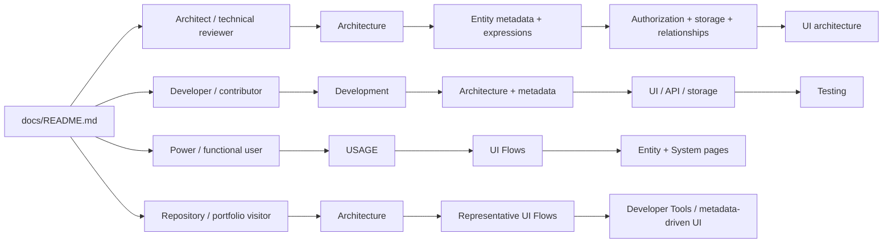

# ManatOS Documentation

This folder is the **documentation hub for the current ManatOS implementation**. It is organized by reader goal rather than by development history.

Git history explains how the system evolved. The documents here explain **what ManatOS is now, why its durable architectural boundaries exist, how the implemented system behaves, and how to extend or operate it**.

## Choose a reading path

### Architect / technical reviewer

Recommended sequence:

1. [`Architecture.md`](Architecture.md) — system boundaries, packages and architectural invariants.
2. [`Entity-Metadata.md`](Entity-Metadata.md) — canonical object and UI-metadata contracts.
3. [`Expression-Evaluation-Mechanics.md`](Expression-Evaluation-Mechanics.md) and [`Expressions.md`](Expressions.md) — CTX/evaluator model and expression language.
4. [`Authorization.md`](Authorization.md), [`Storage.md`](Storage.md), and [`Relationships.md`](Relationships.md) — authoritative security/data boundaries.
5. [`ui/README.md`](ui/README.md) — UI architecture, component ownership and supported flows.

### Developer / contributor

Recommended sequence:

1. [`Development.md`](Development.md)
2. [`Architecture.md`](Architecture.md)
3. [`Entity-Metadata.md`](Entity-Metadata.md)
4. [`ui/README.md`](ui/README.md)
5. [`Storage.md`](Storage.md), [`Relationships.md`](Relationships.md), and [`Error-Handling.md`](Error-Handling.md)
6. [`Testing.md`](Testing.md)

### Power / functional user

Recommended sequence:

1. [`USAGE.md`](USAGE.md)
2. [`ui/UI-Flows.md`](ui/UI-Flows.md)
3. [`ui/Entity-Pages.md`](ui/Entity-Pages.md)
4. [`ui/System-Pages.md`](ui/System-Pages.md)

These documents describe what the current UI supports without requiring the reader to first understand renderer internals.

### Repository / portfolio visitor

Start with the repository [`README.md`](../README.md), then use:

- [`Architecture.md`](Architecture.md) for the technical shape of the platform;
- [`ui/UI-Flows.md`](ui/UI-Flows.md) for representative implemented workflows;
- [`ui/UI-Architecture.md`](ui/UI-Architecture.md) for the metadata-driven UI/runtime model;
- [`Authorization.md`](Authorization.md) for the security boundary.

## Documentation map

| Area                           | Documents                                                                                                                              | What they answer                                                                  |
| ------------------------------ | -------------------------------------------------------------------------------------------------------------------------------------- | --------------------------------------------------------------------------------- |
| System architecture            | [`Architecture.md`](Architecture.md)                                                                                                   | What are the major packages, responsibilities and durable boundaries?             |
| Metadata model                 | [`Entity-Metadata.md`](Entity-Metadata.md)                                                                                             | How are canonical SysBOs, fields, relationships and UI metadata declared?         |
| CTX / expressions              | [`Expression-Evaluation-Mechanics.md`](Expression-Evaluation-Mechanics.md), [`Expressions.md`](Expressions.md)                         | How are expressions parsed, evaluated, scoped and inspected?                      |
| Authentication / authorization | [`Authentication.md`](Authentication.md), [`Authorization.md`](Authorization.md), [`Authentication-Flows.md`](Authentication-Flows.md) | How do identity/session flows and authoritative access decisions work?            |
| Configuration                  | [`Configuration.md`](Configuration.md)                                                                                                 | How is runtime/system configuration represented and administered?                 |
| Relationships / hierarchy      | [`Relationships.md`](Relationships.md), [`Hierarchy-Workspaces.md`](Hierarchy-Workspaces.md)                                           | How are relations and aggregate hierarchy editing modeled?                        |
| Persistence                    | [`Storage.md`](Storage.md)                                                                                                             | What is the storage adapter/query/persistence contract?                           |
| Errors                         | [`Error-Handling.md`](Error-Handling.md)                                                                                               | How are failures represented across API/UI boundaries?                            |
| Development                    | [`Development.md`](Development.md), [`Testing.md`](Testing.md)                                                                         | How should contributors work with and verify the repository?                      |
| UI                             | [`ui/README.md`](ui/README.md)                                                                                                         | How are forms, field components, composite components, pages and flows organized? |
| Usage                          | [`USAGE.md`](USAGE.md)                                                                                                                 | How can an operator/developer use the current system?                             |
| API exploration                | [`postman/`](../postman/)                                                                                                              | How can API contracts be exercised interactively?                                 |

## UI documentation

The UI documentation has its own domain entrance at [`ui/README.md`](ui/README.md). It links to:

- [`ui/UI-Architecture.md`](ui/UI-Architecture.md)
- [`ui/UI-Forms.md`](ui/UI-Forms.md)
- [`ui/UI-Field-Components.md`](ui/UI-Field-Components.md)
- [`ui/UI-Components.md`](ui/UI-Components.md)
- [`ui/UI-Composite-Components.md`](ui/UI-Composite-Components.md)
- [`ui/Entity-Pages.md`](ui/Entity-Pages.md)
- [`ui/System-Pages.md`](ui/System-Pages.md)
- [`ui/UI-Flows.md`](ui/UI-Flows.md)

## Documentation policy

Documentation in this repository is **current-state documentation**. It should:

- explain implemented behavior and durable architectural rationale;
- distinguish current capability from future extensibility;
- serve multiple reader depths without requiring knowledge of project chronology;
- link readers to deeper contracts rather than duplicating them;
- use diagrams where they materially improve understanding.

Temporary patch notes, migration diaries, backlog/progress snapshots and delivery artifacts do not belong in the repository documentation tree.
