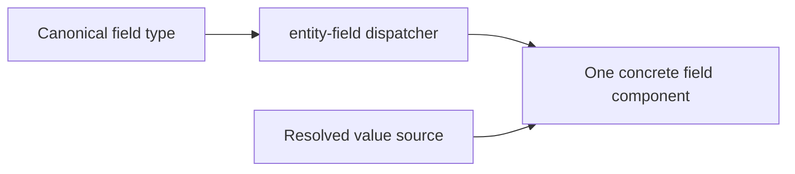

# UI Field Components

The canonical UI Field Components guide has moved to [`docs/ui/UI-Field-Components.md`](ui/UI-Field-Components.md).

Use [`docs/ui/README.md`](ui/README.md) as the UI documentation index.
