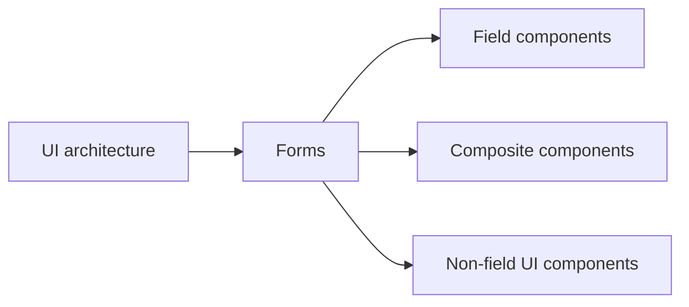

# UI Forms

The canonical UI Forms guide has moved to [`docs/ui/UI-Forms.md`](ui/UI-Forms.md).

```mermaid
flowchart LR
    A[UI architecture] --> B[Forms]
    B --> C[Field components]
    B --> D[Composite components]
    B --> E[Non-field UI components]
```

Use [`docs/ui/README.md`](ui/README.md) as the UI documentation index.
