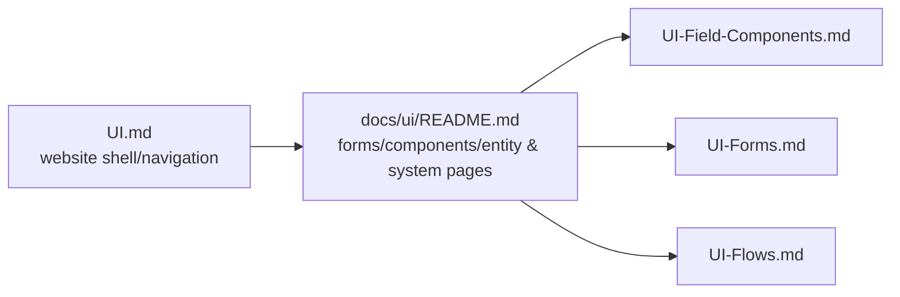
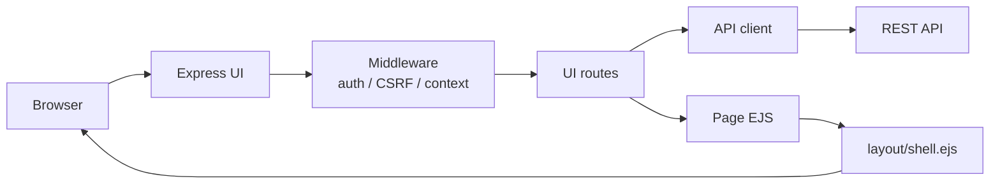
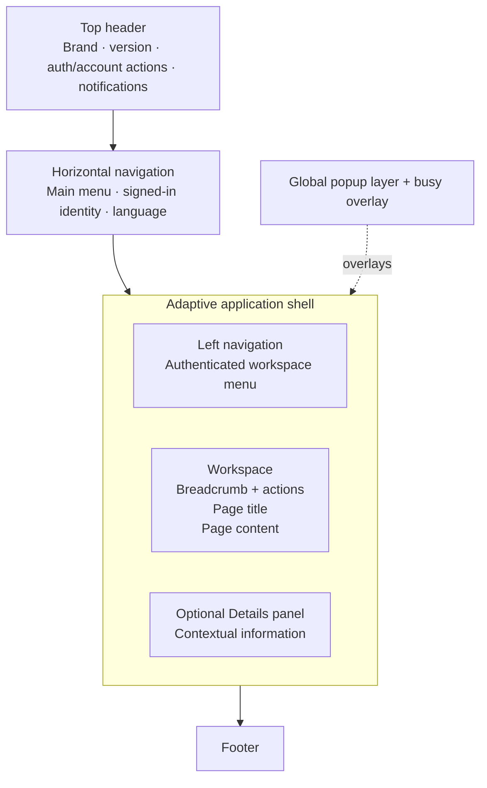

# UI Architecture

**Status:** Under Development / Under Testing

> **UI developer guide:** The detailed component/form architecture is organized under [`docs/ui/`](ui/README.md). This document remains the broader website/shell/navigation architecture reference.



This document describes the current ManatOS website UI architecture implemented by the `ui/` workspace. It is intended to be the primary technical reference for UI layout, rendering, navigation, reusable popup infrastructure, browser-side behavior and UI testing. As additional UI architectures are introduced, they should be documented here rather than being left implicit in individual pages.

## 1. Technology and responsibilities

The UI is an independently runnable **Express 5 + TypeScript** application using **EJS** for server-side rendering, **Bootstrap 5** and **Bootstrap Icons** for the presentation foundation, and small browser-side JavaScript modules for shell behavior, forms, lists, busy states and preferences.

The UI is deliberately separate from the API. It owns website presentation and browser-session state, while business/security operations are delegated to the API through `src/api/client.ts`. SMTP configuration and mail delivery remain API responsibilities; the UI-side `IEmailService` is only a gateway to trusted internal API email endpoints.

Main areas:

```text
ui/
├── src/                     Express/TypeScript UI server
│   ├── auth/                browser/API-session and external-auth integration
│   ├── middleware/          auth, CSRF, request/page context
│   ├── routes/              page, authentication and SysBO routes
│   ├── sysbo/               UI definitions for generic business-object pages
│   ├── security/            transient UI-side security-token handling
│   └── email/               API-backed mail gateway
├── views/
│   ├── layout/              outer application shell
│   ├── pages/               page-specific EJS views
│   ├── components/          reusable layout/navigation/debugging/SysBO components
│   ├── popups/              popup/modal architecture
│   └── errors/              HTTP error presentation
├── public/
│   ├── css/                 CSS architecture
│   ├── js/                  browser behavior modules
│   └── assets/              logos, flags, illustrations and images
└── test/                    Vitest UI/unit/presentation/integration tests
```

## 2. Rendering model

Normal pages are rendered in two stages by `src/presentation/render-page.ts`:

1. the requested page view is rendered with `res.locals` plus its page model;
2. that rendered body is injected into `views/layout/shell.ejs`.

This keeps the global chrome in one place while page views concentrate on page-specific content.



Every page receives a read-only application context through `res.locals.app`:

```text
app
├── version
├── scopes
│   ├── session
│   ├── user
│   ├── request
│   └── workspace
│       └── application      when a SysApplication is active
├── sysBO
└── navigation
```

The separation is intentional: route/middleware code constructs context, while templates consume it rather than independently rediscovering application state.

## 3. Application shell

`views/layout/shell.ejs` owns the adaptive website frame. The shell can render four principal workspace states:

```text
workspace only
left navigation + workspace
workspace + details
left navigation + workspace + details
```

The side areas consume no layout width when they are hidden.

### 3.1 Basic layout illustration



A simplified visual representation is:

```text
┌──────────────────────────────────────────────────────────────────────┐
│ Top header: logo/version                         notifications/account│
├──────────────────────────────────────────────────────────────────────┤
│ Horizontal navigation        signed-in identity      language/flag   │
├───────────────┬──────────────────────────────────┬───────────────────┤
│               │ breadcrumb                 action│                   │
│ Left          ├──────────────────────────────────┤ Right Details     │
│ navigation    │ Page title                       │ panel (optional)  │
│ (signed-in)   ├──────────────────────────────────┤                   │
│               │                                  │                   │
│               │ Main workspace/page content      │                   │
│               │                                  │                   │
├───────────────┴──────────────────────────────────┴───────────────────┤
│ Footer                                                               │
└──────────────────────────────────────────────────────────────────────┘

       Popups/modals and the busy overlay float above the shell.
```

### 3.2 Top header

`views/components/layout/header.ejs` provides:

- theme-aware clickable brand logo;
- application version;
- anonymous **Sign in** / **Sign up** actions;
- authenticated notifications entry point;
- authenticated Account dropdown with account details, personal details, password management and logout.

The Company logo links to the Company/Home experience. Its adjacent version label is the ManatOS/UI application version, while the compact current-platform identity is a separate metadata-driven control that opens the selected platform landing page. ManatOS remains the dominant enclosing brand; the platform identity uses the platform catalogue icon and short name. The horizontal **Platform** navigation is the scalable catalogue surface: with one enabled platform it is a direct link, and with multiple enabled platforms it becomes a menu automatically. This keeps Company identity and product-platform identity visually and architecturally distinct without hard-coding protoCRM into the shell.

The Account dropdown contains the detailed account controls; it is distinct from the compact signed-in identity displayed in the horizontal navigation.

### 3.3 Horizontal navigation

`views/components/navigation/horizontal-nav.ejs` renders metadata/configuration-driven items from `src/navigation.ts` and supports nested menus.

The main navigation exposes **Home → Company → Platform → Resources** plus platform-owned shortcuts such as **Apps Playground** when the current user is entitled to them. The Platform entry is catalogue-driven: with one enabled platform it is a direct link to that platform; with multiple enabled platforms it becomes a dropdown of platform pages without requiring new shell markup. Apps Playground and SysApplications are protoCRM-owned capabilities: Admin bypass applies, while every non-Admin user requires a current effective protoCRM license linked through one of their principals.

For authenticated users, the right side contains a compact signed-in identity immediately before the language selector. This keeps global session identity out of page-specific content such as the Home hero.

The language control currently persists `en` / `el` browser preference and updates `document.lang`. Full literal/content translation is a separate i18n phase.

### 3.4 Left navigation

The authenticated left navigation is generated from `app.navigation.vertical`. It supports nested entries, separators, docked lower actions, authorization filtering, platform-entitlement filtering and UI actions such as opening Preferences. Horizontal and vertical protoCRM shortcuts reuse the same platform contribution so their entitlement rules cannot drift.

It can be collapsed independently. The restore control is intentionally outside the hidden navigation element so it remains available after collapse.

### 3.5 Workspace

The workspace consists of:

- breadcrumb/context row;
- optional workspace actions such as **Details**;
- common page-title surface;
- page content.

Generic SysBO list/edit pages use this workspace rather than implementing independent page shells.

### 3.6 Details panel

The optional right-side Details panel carries contextual page/workspace information. The shell adds or removes the `has-details` state, allowing the central workspace to expand when the panel is closed.

## 4. Navigation architecture

Navigation definitions live in `src/navigation.ts`, not in individual EJS pages. `AppNavMenuItem` currently supports:

- stable `id`;
- visible text and Bootstrap icon;
- URL or child items;
- separators;
- authentication requirements;
- role restrictions;
- client-side UI actions;
- bottom docking in the vertical navigation.

`navigationFor(role, auth, company, platform, ctx)` recursively resolves navigation contributions before rendering them. Company/platform catalogue entries use the single evaluator-backed `visible` metadata contract resolved against request CTX; the retired parallel authentication/role/platform-entitlement flags are no longer part of the navigation contract. Platform access comes only from `ctx.user.permissions.platforms.<platform>.capabilities.platformAccess`; there is no parallel `app.currentPlatformEntitled` or separately passed entitlement flag. Presentation templates therefore receive already-resolved menu entries without introducing another entitlement decision path.

Horizontal platform navigation is derived from the shared `CompanyInfo.platforms` catalogue. Vertical navigation is composed from Company and current-Platform contributions, including shared containers such as Administration and Configuration.

## 4.1 Platform landing pages

`/platform/:platformId` is a generic platform landing route driven by `SysPlatform` metadata. A platform may provide a compact identity icon, hero image, subtitle, introductory copy and capability cards. The same identity metadata is reused by the header, horizontal platform catalogue, Company platform catalogue and landing-page title. protoCRM is presented as the **ManatOS Dynamic Customer Relationship Management Platform**: a platform for defining and evolving CRM applications with configurable business models, relationships and processes, licensing-controlled access, Playground testing and a path toward independent delivery as applications mature. Its current presentation includes a connected customer-relationship network plus Customer 360°, Opportunities, Activities, Communications, Documents and Analytics. Future platforms reuse the same page structure rather than introducing hard-coded protoCRM routes.

Platform-owned feature code is isolated by platform. protoCRM catalogue metadata lives under `shared/src/platforms/protocrm/`, protoCRM routes under `ui/src/platforms/protocrm/`, and protoCRM pages under `ui/views/pages/platforms/protocrm/`, and platform assets/styles under `ui/public/assets/platforms/protocrm/` and `ui/public/css/platforms/protocrm.css`. The generic `ui/src/platforms/routes.ts` composes platform route modules, keeping the general page and SysBO routers free of protoCRM-specific feature branches. The platform presentation metadata may declare its stylesheet so the shell does not hard-code platform IDs.

## 5. Generic SysBO UI

The UI defines website-specific metadata for business-object presentation separately from the shared BO metadata. Current UI model concepts include:

- `ListViewModel`;
- `EditViewModel`;
- `GridConfiguration`;
- `FilterDefinition`;
- `PaginationConfiguration`;
- icons and UI actions.

Generic SysBO pages provide sorting, filtering, pagination, create/edit/delete behavior and authorization-aware actions. This separation allows another client, such as a future mobile application, to reuse BO contracts while defining different UI metadata.

### 5.1 Canonical metadata + UI metadata renderer

The metadata-driven renderer consumes two contracts: canonical SysBO metadata (fields, constraints, calculations and relationships) and framework-neutral UI metadata (tabs, list fields, field overrides, related collections, reusable components and entry actions). The API exposes these as `/$metadata` and `/$metadata-ui`. The generic SysBO UI uses one metadata-driven engine for Users, Principals, Applications, Licenses and External authentication providers. Engine behavior and metadata conventions are architectural contracts shared by **all existing and future** metadata-driven entities and must not depend on a particular entity key.

SysUser is a reference implementation for the full metadata-driven entry contract. Authenticated non-Admin users can reach their own SysUser entry, while authorization and evaluator-backed field metadata keep administrative properties such as Role protected. The owner may view Authentication/external-identity information; self-deletion remains prohibited.

### 5.2 Entry-form state and interaction

Metadata-driven entry forms use one generic state rule: **Save is enabled only when the form is dirty, valid, and no registered child editor currently owns an uncommitted draft**. Dirty state compares current editable/submitted values with the captured baseline, so reverting every edit to its original value returns the form to clean and disables Save again. Calculated/read-only fields do not independently make the form dirty. Native HTML constraints provide immediate validity feedback, while server/API validation remains authoritative.

On opening a record, the first editable field on the first tab receives focus. If that tab contains no editable field, the renderer activates the first later tab that contains one and focuses its first editable field. Tabs whose visible fields are entirely read-only use a very light informational-grey pane; individual read-only/calculated controls use the slightly darker read-only control grey. Create forms still show System details as generated/empty information rather than hiding the tab.

Metadata-driven breadcrumbs are projected from the logical CTX page chain, so an entry opened under a list is represented as `ManatOS > <List> > <Entry>` and the owning list remains navigable. Reusable component tabs are likewise CTX/data driven. The Principal Organization component is the first hierarchy example: it reads the immediate owner's `entries[]` collection together with the child entry's live `entry` record when embedded in an entry page, redraws on relevant CTX changes/tab activation, and offers Tree/Chart presentations with Chart as the Principal default. On an ordinary Principal entry the visualization is informational only; node opening, drag/drop and structural commands are reserved for the dedicated Organization workspace.

Hierarchy workspace footer semantics are explicit: **Cancel** leaves without checkpointing the current unsaved workspace changes, **Close** checkpoints the current owner graph in user-scoped browser-local draft storage (even when structurally incomplete) and leaves the page, and **Commit** first confirms the implied database operations and then performs the single aggregate persistence transaction only when the graph is finalizable.

### Entry representation metadata

One entity entry has a reusable canonical name/type representation and a separate UI entry-icon representation. This removes list/hierarchy-specific `labelField`/`typeField` duplication and keeps the entity/page icon separate from record-instance icons. See `Entity-Metadata.md`.

### 5.2.1 Null reference presentation

Metadata-driven entity entry pages render a null reference as `None` consistently, including editable reference selectors and calculated/read-only reference fields. Reactive recalculation uses the same rule, so an initially-null reference and a reference that becomes null during editing have identical presentation. Developer debugging deliberately remains different: it shows raw evaluator values (`null`, `undefined`, and `''`) rather than UI presentation labels.

### 5.3 Metadata-driven decisions and reactive expressions

Calculated field values and evaluator-driven UI properties share the same expression/dependency mechanism. Expressions are compiled into ASTs during context construction; the browser consumes the AST already supplied by ManatOS and never reparses expression source for each change. Dependencies are extracted from the AST and subscribed to CTX value changes. Every user or calculated mutation goes through the same CTX setter/event path, so dependent calculations may cascade until the affected graph settles without entity-specific event wiring. Dynamic properties currently include field editability/visibility and presentation decisions such as tones/icons, plus tab/action visibility.

`ManatOSDynamicValue<T>` generalizes this beyond SysBO forms: a metadata property is either a static `T` or `{ expression }`, and `SysBOUIDynamicValue<T>` aliases the same contract. CTX owns resolved facts (`mode`, `permissions.*`, `user.permissions.<platform>.capabilities.*`, runtime constraints); metadata owns presentation policy (`visible`, `enabled`, `disabledReason`, `editable`, etc. Navigation, standard Save/Delete actions and list Add decisions now use this pipeline. Generic renderers consume the resolved state and do not add a second role/permission/entitlement gate. API/domain authorization remains authoritative regardless of what the UI renders.

Entry pages expose an immutable normalized `entryOriginal` baseline and a live `entry` working projection; `entry` starts as a clone of `entryOriginal` for both create and edit flows. Collection-owning pages expose `entriesOriginal[]` and `entries[]`, giving child entries one stable owner contract whether the owner is a list, hierarchy workspace or future aggregate editor. Dirty state is derived from the original/current record state rather than from one-off DOM wiring.

Metadata-driven list surfaces share the same toolbar, filters, column header and paging partials in browse and selection contexts. Browse mode navigates and exposes page actions; selection mode selects rows and deliberately suppresses create/actions navigation. Search is part of the shared toolbar. Aggregate-owned selectors publish their temporary list state below the owner page's `selections` branch and may expose a CTX shortcut when Developer Tools are open.

Canonical calculated fields are ordinary typed `fieldDefinition` entries with `calculation.expression`. Calculation is a value-source concern and never selects a different field-component. `calculation.persisted: true` asks the generic service layer to recalculate the value before authoritative persistence so UI forms, direct API calls and automatic/background creation use the same rule. `SysPrincipal.rootPrincipalId` is the current acceptance example and uses resolver-capable `TraverseEntity(...)` independently of the current list snapshot.

### 5.3.1 Field components, UI components and calendar duration

Entity-field controls live under `views/components/sysbo/entry/fields/`. Text, date, datetime, enum, reference, number, boolean and structured **duration** fields use the same canonical dispatcher; read-only/calculated controls retain their field-tool button, with mutating actions disabled rather than hiding the component surface. A duration is one canonical field value with `years`, `months` and `days`, not three unrelated persisted properties.

Reusable non-field/compound visualizations live under `views/components/sysbo/`. Examples include contextual help, related collections, list filters, Debugging and compound workflows. A compound component composes canonical field-components instead of recreating their controls. The License `date-duration-range` component is the acceptance example: `validFrom` and `validUntil` are date-only fields, `validityDuration` is a structured calendar duration, and the three values remain ordinary CTX fields.

Causal recalculation is generic. Native field mutations may carry the originating field path/provenance through the CTX event pipeline; dependent writes preserve that cause and do not become a new user-authoritative source. The expression/dependency infrastructure owns cycle/runaway protection. Components may choose which field is authoritative for an interaction, but they must not invent a private evaluator or a component-specific settling loop.

### 5.4 Development Debugging tab and CTX debugger

Development builds add a read-only **Debugging** tab to metadata-driven entry forms. It lists calculated element name, source formula and current value without displaying the AST. A reusable TypeScript Debugging-model builder (`src/presentation/metadata-debugging-model.ts`) discovers and groups entity-level calculations, entity fields (value/other properties and provenance), related-entity calculations, and UI calculations (tabs, fields, related collections and actions). The EJS view renders that model rather than rediscovering expression semantics itself, which makes the same diagnostic model reusable by future Apps Designer/Playground or alternate clients. Repeated dotted prefixes are grouped/compressed as a diagnostic tree instead of being hard-coded for SysUser.

Debugging inspection distinguishes the **formula definition** from the **current evaluated value**. A row exposes **Inspect formula in CTX Viewer** only when it has a valid definition CTX path and **Inspect current value in CTX Viewer** only when it has a valid live-value path; the action menu is omitted when neither capability exists. This prevents empty diagnostic menus and preserves the distinction between metadata definition and runtime state.

The **CTX VIEWER** is one tab of the unified Developer Tools dock and exposes the live context tree, logical node count, approximate logical payload size and rendered-row count. Root CTX traversal presents `system` first, followed by `entities`, `company`, `user` and `page`; `system` contains the `server` and `client` runtime branches. It uses lazy DOM rendering while the dock itself owns the single outer resize boundary. Transient debugger state remains UI-boot/session scoped so a server restart can reset selections/expansion/history; the active Developer Tools tab is remembered without creating separate dock visibility/geometry for each tool. Properties-panel visibility is preserved independently while selecting or expanding nodes.

### 5.4.1 Generic value presentation

Generic value display is resolved through `src/presentation/metadata-value-presentation.ts` rather than entity-specific renderer branches. Option/enum labels, icons and semantic tones come from metadata `optionItems`/`enumItems`; generic date/datetime/duration/empty-value formatting is centralized there as well. Domain concepts such as an email verification source therefore do not require a renderer format token such as `verification-source`: the canonical/UI metadata supplies the presentation catalogue and every renderer consumes the same generic contract.

This boundary is important for customer-designed protoCRM applications. A future Apps Designer can persist entity/relationship/expression/presentation metadata, while Playground or another renderer consumes those contracts without adding application-specific EJS conditions. EJS is the current renderer, not the owner of application semantics.

### 5.5 Relationship-aware delete confirmation

Before an existing record can be deleted, the UI requests the API `$delete-impact` preflight. The confirmation always tells the user what was found: no related records affected, cascade deletions, relationship unlinking, references cleared through set-null, or restrict relationships that block deletion. If impact information is unavailable, deletion fails safe and remains disabled.

## 6. CSS architecture

The CSS is intentionally split by concern:

| File                       | Primary responsibility                                                                  |
| -------------------------- | --------------------------------------------------------------------------------------- |
| `base.css`                 | baseline/global element rules                                                           |
| `layout.css`               | application shell, navigation, workspace, details and major responsive geometry         |
| `ui.css`                   | reusable UI components, authentication/modal structures and controls                    |
| `theme.css`                | theme-dependent appearance, user preference presentation and selected shell refinements |
| `pages.css`                | generic page-specific presentation                                                      |
| `platforms/<platform>.css` | platform-owned page presentation, selected from platform presentation metadata          |

New reusable component styles should normally go to `ui.css`; shell geometry belongs in `layout.css`; genuinely page-specific rules belong in `pages.css`. Avoid putting page-specific fixes into global component rules merely because they happen to use the same Bootstrap primitive.

## 7. Browser-side JavaScript architecture

The shell loads focused browser modules rather than one large page script:

| File                       | Responsibility                                                                                                                            |
| -------------------------- | ----------------------------------------------------------------------------------------------------------------------------------------- |
| `shell.js`                 | shell state, left navigation, Details panel and general modal/shell behavior                                                              |
| `metadata-form-runtime.js` | metadata/CTX reactive runtime: canonical AST evaluation, dependencies, calculated fields, dynamic UI properties and live debugging values |
| `forms.js`                 | form/page lifecycle: dirty/valid state, Save behavior, password/configuration helpers, focus and unsaved changes                          |
| `lists.js`                 | list/grid interaction                                                                                                                     |
| `busy.js`                  | full-screen busy/locked state during operations                                                                                           |
| `prefs.js`                 | browser-local UI preferences such as theme and language                                                                                   |

The shell loads `metadata-form-runtime.js` immediately before `forms.js`. The split is by ownership rather than page: the reactive runtime owns metadata evaluation and CTX propagation, while `forms.js` owns form lifecycle/presentation behavior. Browser expression execution consumes the canonical compiled AST supplied by ManatOS; it does not reparse metadata expression strings on every field change.

The server remains responsible for authoritative validation/security. Browser validation is primarily usability protection and must not be treated as the security boundary.

`ui-bootstrap-runtime.js` refreshes the anonymous-safe runtime bootstrap independently of page rendering. A failed episode uses bounded backoff for at most 60 seconds and then stops network polling. User activity after suspension triggers a single immediate recovery probe; failure returns to suspended state, while success restores normal low-frequency refresh. Browser DevTools may still show one native `ERR_CONNECTION_REFUSED` for a real failed probe because transport diagnostics are emitted by the browser itself.

# 8. Popup/modal architecture

Popups are a first-class UI architecture. Their reusable implementation is centralized under `views/popups/` so visual spacing, accessibility, action placement and future localization do not drift between unrelated screens.

## 8.1 Terminology

Rich-content popups distinguish two title levels deliberately:

- **Modal title** (`modalTitle`) — the primary title in the popup header, for example **Sign in**.
- **Content title** (`contentTitle`) — the secondary title in the hero/intro content, for example **Welcome back**.

Other semantic fields include:

- `modalSubtitle` — concise subtitle directly beneath the modal title;
- `contentParagraphs[]` — one or more explanatory paragraphs in the rich hero area;
- `illustration` — optional static or parameterized visual;
- content panels — information, choices, fields and guidance specific to the popup;
- left footer actions — normally a **Back** path when the popup belongs to a flow;
- right footer actions — Cancel/Continue/Save/Sign in/etc.

The names are semantic rather than CSS-oriented so they can later map naturally to localized literals. Stable rich-popup copy is centralized in `src/presentation/popup-content.ts` and supplied to views through the common render model. The current object is intentionally a hardcoded English content source, not an i18n engine; it provides the seam that a future language resolver can replace without restructuring EJS templates. Runtime-dependent text, such as an account name validated from a reset token, remains page-model data and is composed with the static content parameters.

## 8.2 Common popup frame conventions

All popup families share common conventions even when their body structures differ:

```text
Popup
├── Header
│   ├── icon
│   ├── modalTitle
│   ├── optional modalSubtitle
│   └── close action, when allowed
├── Body
│   └── family-specific content
└── Footer
    ├── left actions     Back when applicable
    └── right actions    primary/secondary operation actions
```

Reusable primitives currently implemented are:

- `popups/partials/popup-header.ejs`;
- `popups/partials/popup-footer.ejs`;
- `popups/partials/popup-action.ejs`;
- `popups/partials/rich-popup-hero.ejs`;
- `popups/layouts/message-popup.ejs`.

Not every popup is forced through a single universal body template. Reuse is applied at the level where semantics and visual behavior are genuinely shared.

### Central popup presentation tokens

Recurring popup distances are also architecture-level parameters rather than per-popup margins. `public/css/ui.css` defines semantic CSS custom properties on the rich-popup family, including header/body/footer padding, illustration-to-copy spacing, hero-to-content spacing, the **content title → first paragraph** gap and the subsequent paragraph gap.

Individual popup templates should not pass arbitrary pixel/rem values for these recurring distances. They consume the shared defaults; future density/theme variants may override semantic tokens centrally when a real use case requires it. This is the presentation counterpart to the semantic content model above: copy and spacing both have stable, named contracts.

In particular:

- `--popup-content-title-to-first-paragraph-gap` controls the deliberately larger separation between `contentTitle` and the first item in `contentParagraphs[]`;
- `--popup-content-paragraph-gap` controls the tighter rhythm between subsequent paragraphs;
- `--popup-hero-columns-gap` controls illustration-to-copy spacing;
- `--popup-hero-to-content-gap` controls the distance/separator region before panels or form content.

`rich-popup-hero.ejs` emits semantic `popup-content-title` and `popup-content-paragraph` classes, so all rich popups inherit these rules consistently.

## 8.3 Popup families

### Rich-content popups

Rich popups normally contain:

```text
Header
Hero
├── illustration
└── intro copy
    ├── contentTitle
    └── contentParagraphs[]
Content panels / fields / guidance
Footer
```

Authentication flows are the main current users. Their body structures can differ substantially — provider choices, credentials, password rules, account summaries — while still sharing header, hero and footer infrastructure.

### Message and confirmation popups

Simple result/error/confirmation dialogs do not need an auth-style hero. They use compact content and the same action/footer conventions. `popups/layouts/message-popup.ejs` handles the reusable information/warning/error case, including optional expandable operation traces.

Delete and unsaved-change confirmations are grouped under the message family because they share the same compact interaction model even though their content is specialized.

### Other/form popups

Independent UI dialogs that are neither authentication flows nor generic message dialogs live under `popups/other/`. **Website user preferences** is the current example. It shares popup header/footer primitives while owning its settings/form body.

This category is intentionally extensible for future independent dialogs.

## 8.4 Popup folder organization

Current canonical structure:

```text
views/popups/
├── auth/
│   └── auth-modals.ejs
├── messages/
│   ├── message-modals.ejs
│   └── bo-edit-confirmations.ejs
├── other/
│   └── preferences-modal.ejs
├── layouts/
│   └── message-popup.ejs
├── partials/
│   ├── popup-header.ejs
│   ├── popup-footer.ejs
│   ├── popup-action.ejs
│   ├── rich-popup-hero.ejs
│   └── external-provider-buttons.ejs
└── illustrations/
    ├── auth-entry-illustration.ejs
    └── external-link-illustration.ejs
```

Page-specific rich popups that require their own route/page model currently remain in `views/pages/` but consume the reusable popup primitives. Examples include password reset/change and external-account linking. They can migrate further under `views/popups/` later if doing so improves ownership without making route-to-view mapping obscure.

## 8.5 Illustrations

Illustrations are reusable semantic components, not duplicated markup.

`rich-popup-hero.ejs` currently recognizes two illustration kinds:

```text
static
  -> auth-entry-illustration.ejs
  -> semantic modes such as register / signin / password

provider
  -> external-link-illustration.ejs
  -> provider/context-dependent rendering
```

Provider illustrations are intentionally dynamic. Microsoft, Google, Facebook and GitHub use common provider metadata (`key`, label, icon, configured state) so a popup can render the correct provider-specific visual without duplicating an entire popup template.

Future illustrations may add other parameterized contexts; callers should pass semantic illustration configuration rather than raw SVG/CSS markup whenever possible.

## 8.6 Current popup inventory

| Popup                     | Family                       | Modal title                                                                  | Content title / body                       | Inputs or choices                                   |
| ------------------------- | ---------------------------- | ---------------------------------------------------------------------------- | ------------------------------------------ | --------------------------------------------------- |
| Account creation method   | Rich/auth                    | Create your account                                                          | Welcome!                                   | provider choices or Register with Email             |
| Email registration        | Rich/auth                    | Register with Email                                                          | Create your account                        | user name, email, password, confirmation            |
| Sign in                   | Rich/auth                    | Sign in                                                                      | Welcome back                               | provider choices or local identity/password         |
| Password request          | Rich/auth                    | Forgot or set password                                                       | Recover access to your account             | email or user name                                  |
| Password reset            | Rich/auth                    | Set or reset password                                                        | Create a new password                      | new password + confirmation + rules                 |
| Password-link unavailable | Rich/auth informational      | Password link unavailable                                                    | Request a new link                         | Back to sign in / Request a new link                |
| Account password          | Rich/auth                    | Change password / Set password                                               | Secure your account / Create your password | current/new/confirm password as applicable          |
| External account link     | Rich/auth, provider-specific | Link external account                                                        | provider/account ownership explanation     | provider/email summary, existing identity, password |
| Existing external account | Rich/auth, provider-specific | You already have an account                                                  | provider-specific welcome/explanation      | continue sign-in or cancel                          |
| Website preferences       | Other/form                   | Website user preferences                                                     | settings body                              | theme choices and Save                              |
| Information/success       | Message                      | contextual                                                                   | short message                              | OK or follow-up action                              |
| Warning                   | Message                      | contextual                                                                   | short warning                              | OK or follow-up action                              |
| Operation failed          | Message/error                | Operation failed                                                             | safe error + optional operation trace      | Cancel and optional Retry                           |
| Delete entry              | Message/confirmation         | Friendly record/entity title (for example `Delete Google External Provider`) | destructive warning                        | Cancel / Delete                                     |
| Unsaved changes           | Message/confirmation         | Unsaved changes                                                              | unsaved-state warning                      | Cancel / Discard / Save                             |

`external-registration.ejs` is currently a page/content-card flow rather than a modal; it is therefore not included as a popup despite belonging to the wider authentication UX.

## 8.7 Footer/action rules

Popup actions follow a consistent positional convention:

- **leftmost**: Back/navigation-to-previous-step when the operation is a multi-step flow;
- **rightmost**: secondary and primary operation actions;
- destructive primary actions use the destructive Bootstrap variant;
- forms that require valid input can render their submit action disabled until client-side usability checks pass;
- authoritative validation still occurs server/API-side.

`popup-action.ejs` supports button and link actions, icons, Bootstrap variants, dismiss/toggle/target behavior, disabled state, click handlers and data attributes.

## 8.8 Busy-state integration

Long-running form operations use `data-busy-submit` plus semantic busy title/message/icon attributes. `public/js/busy.js` presents a full-screen locked overlay while the request is in progress.

This avoids duplicate submissions and gives explicit feedback during operations such as registration, password reset/change and external-account linking.

External-provider credential testing uses the same locked-form principle but keeps provider authentication in a temporary browser window. The Admin page polls authoritative server-side test state, offers **Cancel test**, detects a manually closed provider window, and preserves the entered credential pair after cancellation/failure so the Admin can correct, retry, or save the pair securely as unverified. Existing stored-but-unverified credentials can be retested without re-entering the secret.

## 8.9 Popup architecture extension rules

When adding a popup:

1. decide whether it belongs to `auth`, `messages` or `other`;
2. reuse `popup-header` and `popup-footer` unless there is a concrete UX reason not to;
3. use `rich-popup-hero` for illustration + `contentTitle` + `contentParagraphs[]` introductions and source stable auth copy from the centralized popup content model;
4. use shared semantic popup spacing tokens rather than adding flow-specific margins for recurring layout relationships;
5. reuse or extend semantic illustrations rather than copying illustration markup;
6. keep flow-specific content panels in the owning popup/page;
7. keep **Back** at the left and operation actions at the right;
8. add presentation tests for the shared contract and behavior-specific tests for the popup itself;
9. add new reusable abstractions only after at least two real consumers demonstrate the common structure.

This avoids both markup duplication and premature “universal component” abstractions full of nullable fields.

## 9. Authentication UI boundaries

Authentication presentation is split across server routes, provider metadata and popup/page templates. Current external provider choices are Microsoft, Google, Facebook and GitHub. Providers remain visible even when not configured. The UI may store an Admin-supplied credential pair before verification, but the provider is treated as not configured for sign-in until it is enabled and the current stored pair has `credentialsVerified=true`.

Password recovery deliberately uses a privacy-neutral public confirmation so the UI does not disclose whether an entered identity exists. Password/reset links use transient one-time tokens; the detailed token/storage semantics are documented in `docs/Authentication-Flows.md`.

## 10. Preferences and themes

The Preferences popup currently controls the browser-local theme. Theme and selected language are persisted per website-user ID (or `anonymous`) in browser `localStorage` and restored early in `shell.ejs` before styles paint.

The supported theme values are currently `lighter` and `darker`. Theme-specific brand assets are selected before paint to avoid an incorrect-logo flash.

## 11. Error presentation

Navigation/HTTP failures use EJS error pages. Application errors can be projected into the reusable **Operation failed** popup.

The popup shows a safe user-facing message and can expose a collapsible semantic operation trace for power-user diagnostics when one is supplied. Sensitive values are sanitized upstream; presentation code should not attempt to reconstruct hidden secrets.

## 12. UI test architecture

The current UI test suite uses **Vitest** with several complementary styles:

### Unit/domain-adjacent UI tests

Examples:

- `api-session.test.ts` — API-session bridge helpers;
- `auth-middleware.test.ts` — browser authentication middleware;
- `external-providers.test.ts` — provider metadata;
- `microsoft-profile.test.ts` / `github-profile.test.ts` — provider normalization;
- `recovery-identity.test.ts` — recovery-input syntax;
- `security-token-store.test.ts` — transient token rules.

These tests should remain close to deterministic TypeScript behavior and avoid EJS rendering unless presentation is the actual subject.

### Presentation/component-contract tests

EJS is rendered directly and inspected with Cheerio. Examples:

- `auth-presentation.test.ts`;
- `account-password-presentation.test.ts`;
- `password-reset-presentation.test.ts`;
- `home-presentation.test.ts`;
- `message-modals-presentation.test.ts`;
- `popup-infrastructure-presentation.test.ts`.

These tests protect structure and semantic contracts that TypeScript compilation cannot see: modal wiring, shared partial usage outcomes, disabled actions, labels, identity placement, provider visuals and required data attributes.

The popup-refactor regression that produced `isOwnSysUser is not defined` is a good example: build/type-checking succeeded, while EJS rendering tests correctly detected the broken include dependency.

### UI route/integration tests

`ui.integration.test.ts` uses Supertest plus selected rendered views/API-client mocks to exercise UI-route authorization, CSRF behavior and SysUser delete flows.

### Test organization

Presentation, unit and route/integration tests protect different layers of the UI contract. Test placement should follow those responsibility boundaries as the suite grows; directory organization is secondary to keeping each test's architectural purpose explicit.

### Future browser E2E layer

Vitest/EJS/Cheerio/Supertest do not replace a real browser. Playwright is the planned higher-level layer for behaviors such as:

- complete authentication and recovery flows;
- Bootstrap modal transitions/focus behavior;
- responsive shell states;
- side-navigation/details interactions;
- actual browser validation and password visibility controls;
- optional real SMTP/IMAP integration scenarios using dedicated test accounts.

The browser E2E layer should complement, not replace, the faster unit/presentation/integration suite.

## 13. Known UI evolution areas

Current or planned areas include:

- multilingual/i18n literal extraction and translation;
- continued refinement of role/record-specific capabilities as additional SysBOs move to the metadata-driven renderer;
- platform/multiplatform responsive behavior;
- notifications subsystem;
- broader centralized field-validation architecture;
- Playwright browser E2E tests;
- further popup families only when new real use cases justify them.

Keep this document updated when a new reusable UI architecture is introduced.

## Metadata-driven contact collection editors

Principal Contact collections use the generic transactional `collection-editor` component. The component edits the current entry page's `entry` only; persistence remains bounded by the parent entry **Save** operation. Email-address and telephone-number rows can be edited either through the pencil action or by activating the displayed value itself. Delete removes the relationship from the editing buffer; canonical shared contact rows are not immediately destroyed.

Telephone country selection is presentation metadata. The visible option may include a country flag when ManatOS already has a corresponding presentation asset/representation; currently Greece uses `/assets/flags/el.svg` and the United Kingdom uses `/assets/flags/en.svg`; unflagged countries reserve the same visual space without inventing an asset. Only the calling code and telephone data participate in persistence.

## Debugging CLI

The metadata entry Debugging area opens on **CLI**, followed by **Entity** and **UI**. The CLI prompt is rendered inside the dark terminal surface and evaluates canonical ManatOS ASTs against `currentCtxNode` (initially `ctx.page.page`).

Commands:

```text
.       print currentCtxNode, formatted
..      print its parent CTX node, formatted
cls     clear the visible transcript
clear   alias of cls
```

`cls`/`clear` affect only the transcript and are not added to history. Expression history is stored in browser `localStorage`, scoped by entity type, capped at 9,999 commands per entity type, and stores commands only (never results). Arrow Up/Down navigate that history across different entries of the same entity type.

Expressions themselves are compiled by the canonical server parser and evaluated from the returned AST; the browser does not implement a second expression parser.

### Compact related-contact collections

Reusable `collection-editor` instances may declare `collapsible: true`. Their heading then toggles between the ordinary row list and a compact wrapped summary whose values remain visually separated objects. When an inline Add/Edit editor is open, the heading toggle is disabled; collapsing never commits or cancels editor state. A fresh entry-page visit starts collapsible collections compact. The state then lives only in that page DOM instance, so tab switching preserves the user's choice while navigation away/back naturally restores the compact default. Clicking a compact summary object expands the collection and opens that exact item for editing.

### Parent/child entry editing state

Reusable inline editors register themselves with the owning metadata-driven entry page. While any child editor is active, `ctx.page...state.internalEditing` is true and `internalEditorCount` reports the active-editor count. Parent Save/Save-and-Close controls are disabled until each draft is explicitly committed with Add/Update or discarded with the child Cancel action. Parent Cancel and Delete remain parent-level actions and are not blocked by child-field validation. This state contract is entity-agnostic and applies to future editable collections as well as Principal contacts.

## Developer API Traffic Viewer

Development builds expose **CTX Viewer** and **API Traffic** as tabs of one shell-owned **Developer Tools dock**. There is one dock visibility state, one outer application/dock resize boundary and one active-tab state. Switching tabs does not recreate either tool's internal state. Additional developer tools should be added as tabs rather than as new docked peer panels.

The API Traffic tab shows sanitized UI-server -> API transport traffic, including method, compact API path (`/api/v1/` is displayed as `./`), HTTP status, duration, request correlation id, request payload and response payload. Newest requests appear first. The selected request inspector is above the list and exposes separate **Request** and **Response** tabs. In the path column only the resource/entity segment is emphasized (for example `./` + **`SysUsers/`** + `<id>`), leaving ids/query/operation suffixes visually secondary.

The API-call chooser stores durable per-route visibility selections. The adjacent **Ignore API call visibility selections** toggle temporarily bypasses those selections and shows all captured calls without modifying the saved chooser state; errors-only and text search filters still apply.

The toolbar provides pause, clear, errors-only filtering, text search and a distinct-call checklist. The checklist normalizes volatile ids/query variants into route patterns, remembers each route's show/hide selection, and displays a boot-lifetime counter for each pattern. Counters accumulate across ordinary navigation for the current UI-server boot and are not durable local preferences; known zero-count routes remain below a separator so prior visibility choices are still available. Hidden calls remain captured and may be re-enabled. Sensitive values are redacted before they enter the in-memory trace buffer; authorization headers and process secrets are never captured.

API Traffic polling is sequential: a new diagnostic poll is not started while the previous one is still pending. The shared connectivity watchdog counts transport failures rather than HTTP error responses. After three consecutive connection failures ManatOS renders a local **System unavailable** workspace, stops automatic polling, and waits for an explicit page refresh or navigation click before retrying. This prevents an unavailable API/UI service from producing an unbounded console/request storm.

### Developer dock placement invariant

The shell reserves one right-side column for the Developer Tools dock. The dock fills the available shell height and never participates as another application-shell row. CTX Viewer/API Traffic are tab contents, so there is no internal CTX/API resize divider and no peer-panel width/height negotiation. The only horizontal developer resize is the outer application/dock boundary.

### Detailed form/component contracts

See [UI Forms and UI Components](UI-Forms.md) for form/tab/UI-component composition and [UI Field Components](UI-Field-Components.md) for the canonical field-component pipeline, value-source independence and extension rules.
