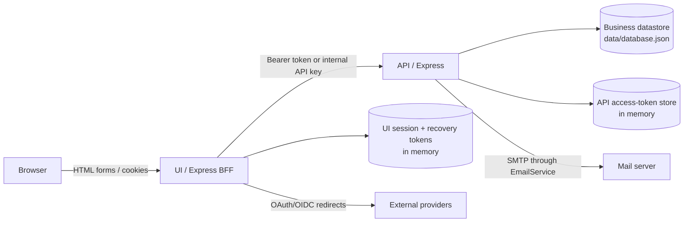
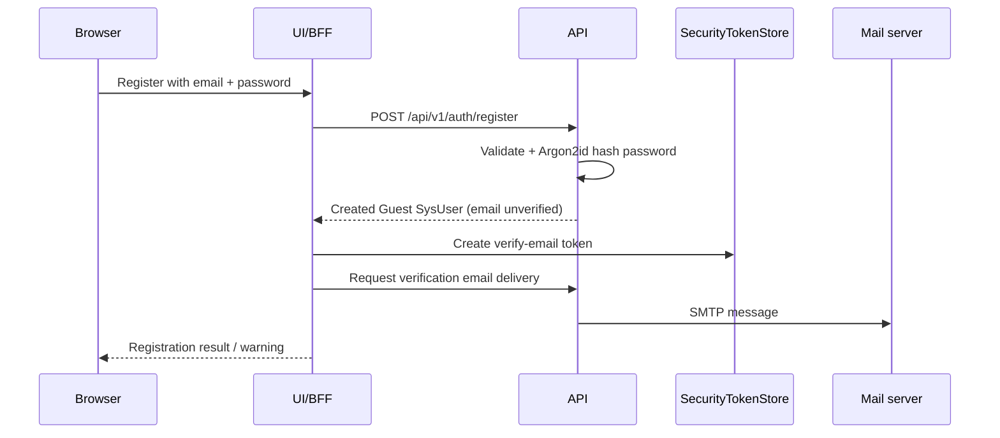
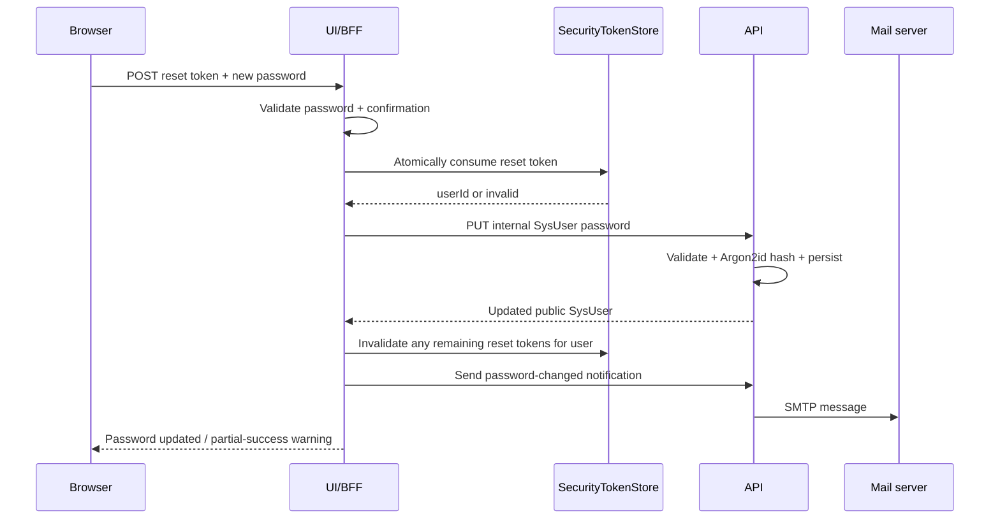

# Authentication flows

This document describes the authentication and account-recovery flows implemented by ManatOS at the time of writing. It is intentionally implementation-oriented: each flow states which process owns the operation, what is stored, where it is stored, and when transient credentials become invalid.

> **Scope note**
> The current persistence layer is the API in-memory datastore backed by `data/database.json`. Authentication/session/recovery stores are still process-local and are therefore cleared when their owning Node.js process restarts.

## 1. Components and trust boundaries



The browser never receives SMTP credentials, password hashes, the internal API key, or stored token hashes. SMTP delivery is owned by the API-side `EmailService`. The UI/BFF owns browser sessions, CSRF state, external-provider redirects, email-verification links, and password-reset links.

## 2. Storage map

| Artifact | Owner | Stored where | Stored form | Lifetime / invalidation |
| --- | --- | --- | --- | --- |
| `SysUser.passwordHash` | API | Current business datastore (`data/database.json`) | Argon2id hash | Replaced when password is set/changed |
| `SysUser.passwordChangedAt` | API | Business datastore | ISO timestamp | Updated with password |
| Email verification state | API | `SysUser` in business datastore | `emailVerified`, timestamp, source | Persistent |
| External identities | API | Business datastore | Provider, provider subject, provider email/metadata | Persistent until unlinked/deleted |
| API access token | API | `AccessTokenStore` in API memory | Raw token returned once; SHA-256 hash retained in store | Expiry, logout/revocation, or API restart |
| UI session | UI/BFF | Default `express-session` MemoryStore | Session data referenced by `manatos.sid` cookie | Idle timeout, logout, or UI restart |
| CSRF token | UI/BFF | UI session | Random session value; copied into forms | Session lifetime |
| Email-verification token | UI/BFF | `SecurityTokenStore` in UI memory | Token id + SHA-256 hash; raw secret only in URL/email | One-time, expiry, invalidation, or UI restart |
| Password-reset token | UI/BFF | `SecurityTokenStore` in UI memory | Token id + SHA-256 hash + user id + display label | One active reset token per user; one-time; 30 min; UI restart |
| SMTP credentials | API | `SysConfiguration` + deployment bootstrap defaults | Host/user settings as configuration; password encrypted at rest | Persistent configuration; never returned to UI |
| External-provider Client Secret | API | `SysExtAuthProvider` in business datastore | AES-GCM encrypted | Replaced/removed by Admin; never returned to UI |

### Password hashing

Local passwords are validated against the shared password policy and hashed by the API with Argon2id. The clear-text password is not persisted.

### Recovery-token representation

The emailed recovery value is a compound opaque token:

```text
<random token id>.<random 32-byte base64url secret>
```

The raw compound value is sent in the recovery URL. The UI process stores only the token id and a SHA-256 hash of the raw secret-bearing value, together with the associated user id, purpose and expiry. A modified raw token therefore does not match the stored hash.

## 3. Local registration and email verification



A local registration creates the account before email delivery is attempted. Consequently, a mail-delivery failure must not be reported as if account creation failed. The account remains enabled but email-unverified, and local API login remains blocked until verification succeeds.

Verification links are one-time and time-limited. The UI consumes the verification token and uses a trusted internal API operation to mark the `SysUser` email verified. External-provider verification may invalidate still-live email-verification links while retaining enough transient provenance to explain that the address was already verified through another provider.

## 4. Local sign-in

1. Browser submits email/user-name + password to the UI.
2. UI calls public API login.
3. API resolves the enabled user, verifies the Argon2id password hash, and requires verified email.
4. API creates an opaque access token in the in-memory `AccessTokenStore` and returns the raw token once.
5. UI stores the API token/session identifiers in its server-side Express session; the browser receives only the UI session cookie.

An account with a configured password but unverified email is intentionally unable to complete local login.

## 5. Forgot / set password request

The public recovery UI accepts either:

- a user name with at least the same minimum length as registration; or
- a syntactically valid email address.

Once the input contains `@`, it is treated as an email candidate and must satisfy email syntax before **Send instructions** is enabled.

The server deliberately does not disclose account existence. A valid-format real identity and a valid-format nonexistent identity receive the same visible confirmation:

> If an eligible account matches the information provided, password instructions have been sent to its registered email address.

For an existing eligible user:

1. UI uses the trusted internal lookup endpoint.
2. `SecurityTokenStore.create(..., 'reset-password')` **invalidates every previous outstanding reset token for that user first**.
3. A fresh 30-minute token is created in UI memory. Only its hash is retained.
4. The API email service sends the raw token in a reset URL to the user's registered email address.

This means there is at most **one active password-reset link per user**.

## 6. Opening a password-reset link

`GET /auth/password/reset?token=...` performs a non-consuming inspection of the token.

If usable, the reset popup is shown and may display the associated user name stored as non-sensitive token presentation metadata. Merely opening or reopening a usable link does **not** consume it.

If the token is malformed, tampered, expired, superseded, already used, or otherwise invalid, the UI shows **Password link unavailable** and offers **Back to sign in** and **Request a new link**.

A tampered-token attempt does not consume the untouched original token because only a matching stored hash can be consumed.

## 7. Completing a password reset



Required invariants:

- A consumed token cannot be replayed.
- Issuing Token B invalidates outstanding Token A for the same account.
- Successfully completing a reset invalidates every other outstanding reset token for that account.
- Reset tokens belonging to other users are unaffected.
- Expired tokens are rejected without needing long-running tests; automated tests use an injectable clock.
- Password persistence is the primary operation. If the subsequent confirmation email fails, the UI reports **password updated with a warning** rather than falsely reporting that the password update failed.

## 8. Authenticated change / set password

An authenticated user manages the local password through the normal Bearer-protected API route.

- If a local password already exists, the API requires and verifies `currentPassword` before replacing it.
- If no local password exists, an authenticated account may set one according to current policy.
- The new password must satisfy the shared password policy and confirmation check.
- The API persists a new Argon2id hash and updates `passwordChangedAt`.
- A password-changed email is attempted afterward; mail failure is a secondary warning, not a rollback of the successful password change.

Password-history/reuse prevention is **not currently implemented**. Older passwords may therefore be reused; any future password-history policy belongs to authentication-security hardening.

## 9. External-provider authentication

Microsoft, Google, Facebook and GitHub are handled by the UI/Passport layer. Provider identity is resolved by provider + provider subject. Matching email alone never silently links an external identity to an existing account; ownership confirmation is required according to the linking flow.

Provider configuration is Admin-managed. A Client ID/Client Secret pair is kept as one credential unit and may be stored securely before provider verification. Stored-but-unverified credentials persist with `credentialsVerified=false` and are treated as not configured for sign-in. A successful OAuth credential-test marks the exact stored credential version verified and records `credentialsVerifiedAt`; only enabled and verified providers are offered to end users. During testing the original Admin form remains locked while the provider interaction happens in a temporary browser window; server-side pending state/polling is authoritative so popup lifecycle quirks cannot silently activate unverified credentials.

After provider authentication resolves a ManatOS account, the trusted UI asks the API to mint an ordinary API access-token session. Multiple external identities may belong to one `SysUser`.

Provider-reported email-verification state remains distinct from ManatOS account email-verification state.

## 10. Mail delivery failure policy

Mail is a secondary operation whenever the primary business mutation has already succeeded.

Examples:

- Registration succeeds but verification mail fails: account remains created and unverified; UI reports a warning and should eventually create an Admin notification for assisted verification.
- Password update succeeds but confirmation mail fails: password remains changed; UI reports the successful update plus delivery warning.

SMTP/provider failures are logged server-side without logging SMTP passwords, OAuth secrets, clear-text passwords, recovery tokens or authorization headers.

## 11. Automated regression coverage

The normal Vitest verification suite should protect the deterministic security rules without depending on the real mail server:

- token inspection does not consume a token;
- tampered token is rejected and does not invalidate the untouched original;
- Token B supersedes Token A for the same user;
- a new token for one user does not invalidate another user's token;
- consumed token cannot be replayed;
- successful-reset cleanup invalidates remaining reset links;
- expiry is tested with an injectable clock rather than sleeping 30 minutes;
- reset UI shows target account identity only after token validation;
- recovery form starts disabled and exposes the client-side identity-validation hooks.

Real SMTP/IMAP tests and browser-level Playwright E2E tests are intentionally separate future layers so `npm run verify` remains fast and deterministic.

## 12. Known follow-up work

- Persistent/distributed session and recovery-token stores (for multi-instance deployment and survival across process restarts).
- Generic user/Admin notification subsystem for mail-delivery fallback and the existing notifications UI.
- Optional password-history policy.
- Optional real SMTP/IMAP integration tests using dedicated test mailboxes.
- Browser-level Playwright E2E authentication flows.
- Multilingual extraction of user-facing authentication literals.
