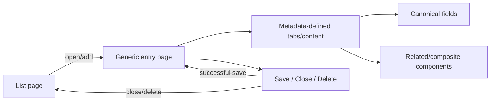
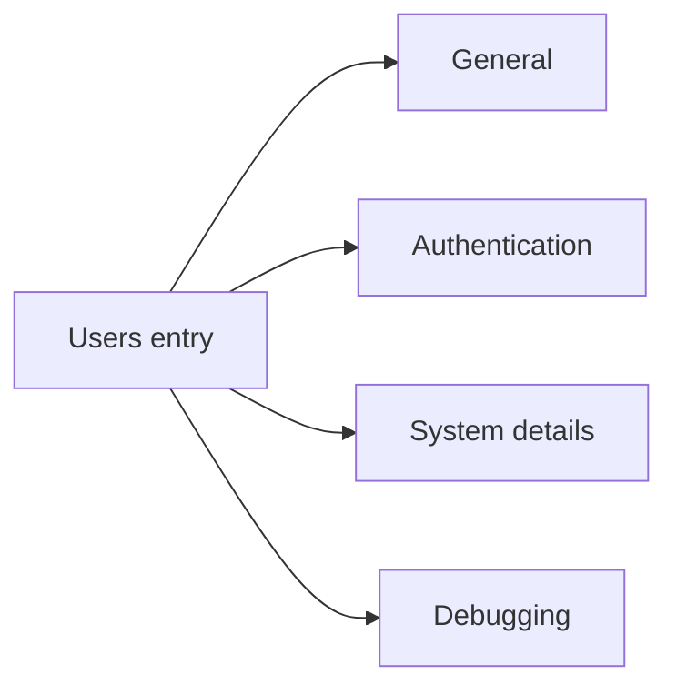
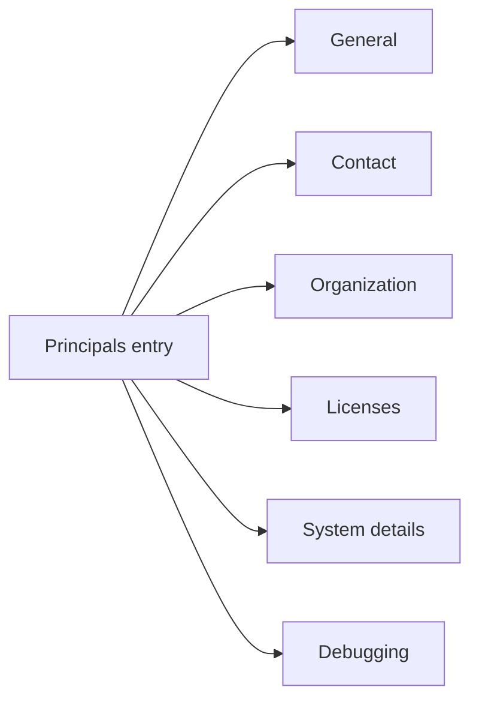
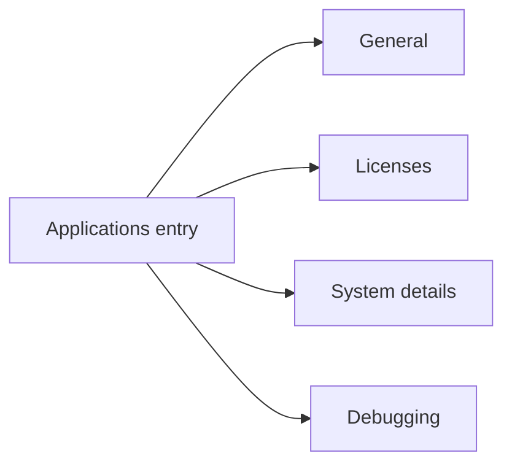
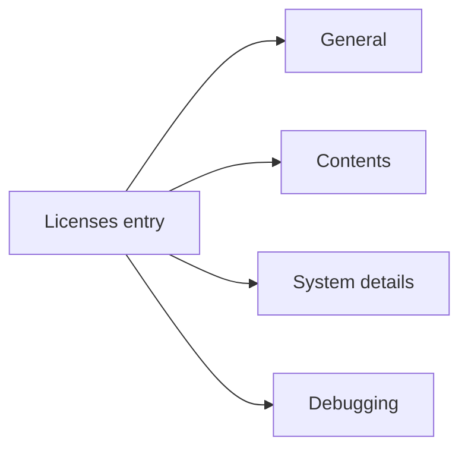

# Metadata-Driven Entity Pages

## Purpose

This guide describes the generic SysBO list/entry structure and identifies current entities that serve as model examples. Entity pages should be defined through canonical metadata + UI metadata and rendered by shared infrastructure, not by entity-specific form engines.

## Generic entity page lifecycle

## List-page responsibilities

The generic list surface owns list title/icon, count, filters, search, sorting, paging, Add actions, configured columns, canonical value presentation and entry actions. Entity metadata/UI metadata supply what is shown; list infrastructure supplies how common list behavior works.

## Entry-page responsibilities

The generic entry surface owns title/icon, tabs, form lifecycle and entry actions. Tabs may combine canonical fields, related collections, composite components, System details and Debugging. Concrete field behavior always remains in field components.

## Current reference entities

The current reference entities are shown separately so the diagrams remain readable at normal documentation widths.

### Users page structure

### Principals page structure

### Applications page structure

### Licenses page structure

### Users

Use Users as the model for ordinary editable text/contact fields, calculated/readonly text, boolean state, metadata-driven enum selection (Role), authentication summary content and external-identity related collections. Role demonstrates that enum option icon/label presentation belongs to `enum-select.ejs`, not the User entity template.

### Principals

Use Principals as the strongest reference/reference-field model. `Parent principal` and calculated `Root principal` are both canonical `reference` fields and therefore use the same `reference-select.ejs` component despite different value sources/editability. Typed Principal entry representation demonstrates canonical entry icon + name behavior. Organization and Licenses demonstrate higher-level relationship components.

### Applications

Applications provide a relatively compact metadata-driven entry model and a Licenses related collection. It is useful when creating a straightforward new SysBO without the additional authentication/contact/hierarchy concerns of Users or Principals.

### Licenses

Licenses demonstrate multiple reusable field types in one entity: reference (`Customer`, `Application`), enum (`Status`, `Platform` where represented as an option field), numeric (`Quantity`), date/duration fields and the date-duration composite. Its list also demonstrates canonical reference/enum presentation across columns.

## Model-selection guide

| Need                                 | Inspect first                               |
| ------------------------------------ | ------------------------------------------- |
| minimal metadata-driven entity entry | Applications                                |
| enum field with icons                | Users Role / Licenses Status                |
| editable + calculated references     | Principals Parent/Root principal            |
| typed related-entry icon/name        | Principals                                  |
| related collections                  | Applications Licenses; Users Authentication |
| date + duration composition          | Licenses Contents                           |
| hierarchy/organization UI            | Principals Organization                     |
| informational/authentication tab     | Users Authentication                        |

## Rule for future entities

A new entity should normally require **metadata**, not a new rendering architecture. Add generic infrastructure only when the capability is genuinely reusable across entities. If a proposed entity template contains its own enum/reference/date rendering, calculation branch or field tool logic, that is a signal that the implementation is crossing responsibility boundaries.

## Reference examples for component embedding

The current entities illustrate the intended boundaries:

| Example                          | What to copy                                                                                              |
| -------------------------------- | --------------------------------------------------------------------------------------------------------- |
| User General                     | ordinary form-field pipeline; enum + calculated string fields                                             |
| Principal General                | ordinary direct and calculated `reference` fields using one reference component                           |
| License Contents                 | composite layout that reuses normal canonical fields through `form-field.ejs`                             |
| Principal hierarchy quick editor | component-owned canonical draft fields dispatched through `entity-field.ejs` with local binding ownership |
| External Provider credentials    | mixed workflow: canonical `clientId` via dispatcher; transient secret via non-entity workflow input       |

The examples are models for **responsibility boundaries**, not invitations to copy entity-specific markup.
