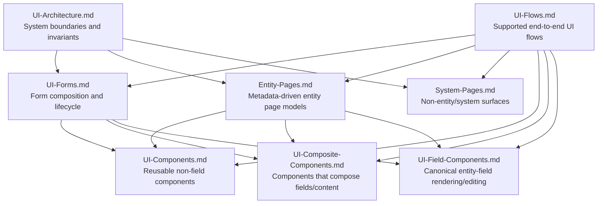
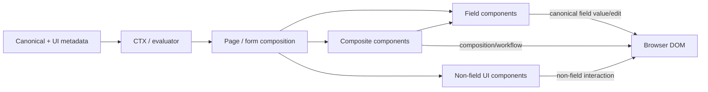

# ManatOS UI Documentation

## Purpose

This directory is the canonical developer/architect guide to the ManatOS UI architecture. It describes the ownership boundaries between pages, forms, canonical entity fields, reusable UI components, composite components, CTX/evaluator infrastructure, and metadata.

The governing design rule is:

> **Canonical field type determines the field component. Value-source semantics determine only how that component receives or updates its value.**

A calculated reference is therefore still a `reference`; a calculated string is still a `string`. Calculation, persistence, defaults and live CTX changes are value-source concerns, not alternative presentation models.

## Reading paths

You do not need to read this directory linearly.

| Audience / goal                                       | Recommended path                                                         |
| ----------------------------------------------------- | ------------------------------------------------------------------------ |
| understand what the UI supports                       | `UI-Flows.md` → `Entity-Pages.md` / `System-Pages.md`                    |
| review the UI architecture                            | `UI-Architecture.md` → `UI-Forms.md` → component guides                  |
| implement or extend an entity                         | `Entity-Pages.md` → `UI-Forms.md` → `UI-Field-Components.md`             |
| implement a reusable multi-field or non-field feature | `UI-Composite-Components.md` / `UI-Components.md` → `UI-Architecture.md` |
| inspect a workflow end to end                         | `UI-Flows.md` → the linked page/form/component sections                  |

`UI-Flows.md` is the functional bridge: it describes the screens and transitions a user sees, then links those steps to the reusable architecture that implements them.

## Documentation map

| If you are...                                                   | Read first                   | Then                                      |
| --------------------------------------------------------------- | ---------------------------- | ----------------------------------------- |
| changing UI architecture or metadata/rendering boundaries       | `UI-Architecture.md`         | the relevant specialized guide            |
| creating/changing an entry form                                 | `UI-Forms.md`                | `Entity-Pages.md`, field/composite guides |
| adding a canonical field type                                   | `UI-Field-Components.md`     | `UI-Architecture.md`                      |
| arranging several existing fields as one visual unit            | `UI-Composite-Components.md` | `UI-Forms.md`                             |
| adding a collection, hierarchy, panel or other non-field widget | `UI-Components.md`           | `UI-Forms.md`                             |
| implementing a new metadata-driven entity                       | `Entity-Pages.md`            | `UI-Forms.md`, `UI-Field-Components.md`   |
| implementing authentication/account/debug/system UI             | `System-Pages.md`            | `UI-Components.md`                        |
| tracing or documenting an end-to-end supported workflow         | `UI-Flows.md`                | linked page/form/component guides         |

## Responsibility map

### Group-level ownership

| Layer                    | Owns                                                                                                                                                                           | Does not own                                               |
| ------------------------ | ------------------------------------------------------------------------------------------------------------------------------------------------------------------------------ | ---------------------------------------------------------- |
| Canonical metadata       | field semantics, type, constraints, relationships, calculations                                                                                                                | HTML/control implementation                                |
| UI metadata              | tabs, layout, presentation policy, component declarations/options                                                                                                              | duplicate business-field semantics                         |
| CTX/evaluator            | current state, expression evaluation, dependency propagation                                                                                                                   | field-type rendering                                       |
| Page/form infrastructure | composition, tabs, form transaction/lifecycle, dirty/valid state, page actions                                                                                                 | concrete field-type editors                                |
| Field components         | complete canonical field UI: resolved value presentation, editing, formatting, icon/label representation, validation presentation, CTX/DOM synchronization and field tool menu | calculation engine, persistence orchestration, page layout |
| Composite components     | arrangement/coordination of multiple canonical fields/content items                                                                                                            | alternative field/value semantics                          |
| Non-field UI components  | reusable collections, panels, hierarchy/workflow/debug/navigation interaction                                                                                                  | pretending non-field content is a canonical field          |

## Core implementation principle

When deciding where new UI code belongs, ask **what semantic thing is being rendered** rather than where it happens to appear. If it is one canonical entity field, it belongs in the field-component pipeline. If it combines several fields/content items, it is a composite component. If it is not a field at all, it belongs in reusable UI components or page/system infrastructure.

## Existing-record selection

The generic **Select existing entry** popup is documented in [`UI-Components.md#existing-record-selector`](UI-Components.md#existing-record-selector). Reference-field use is covered in [`UI-Field-Components.md#selecting-from-the-generic-record-browser`](UI-Field-Components.md#selecting-from-the-generic-record-browser), and end-to-end usage appears in [`UI-Flows.md`](UI-Flows.md).
