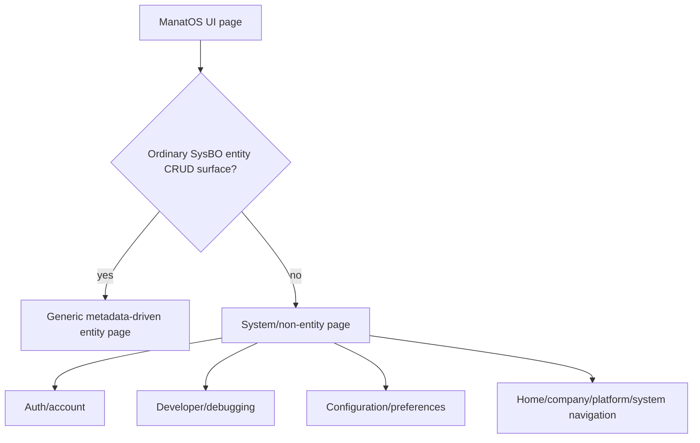
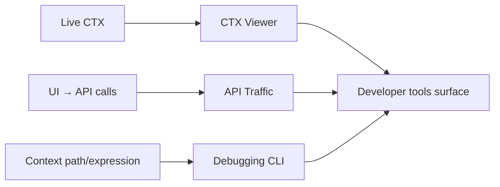
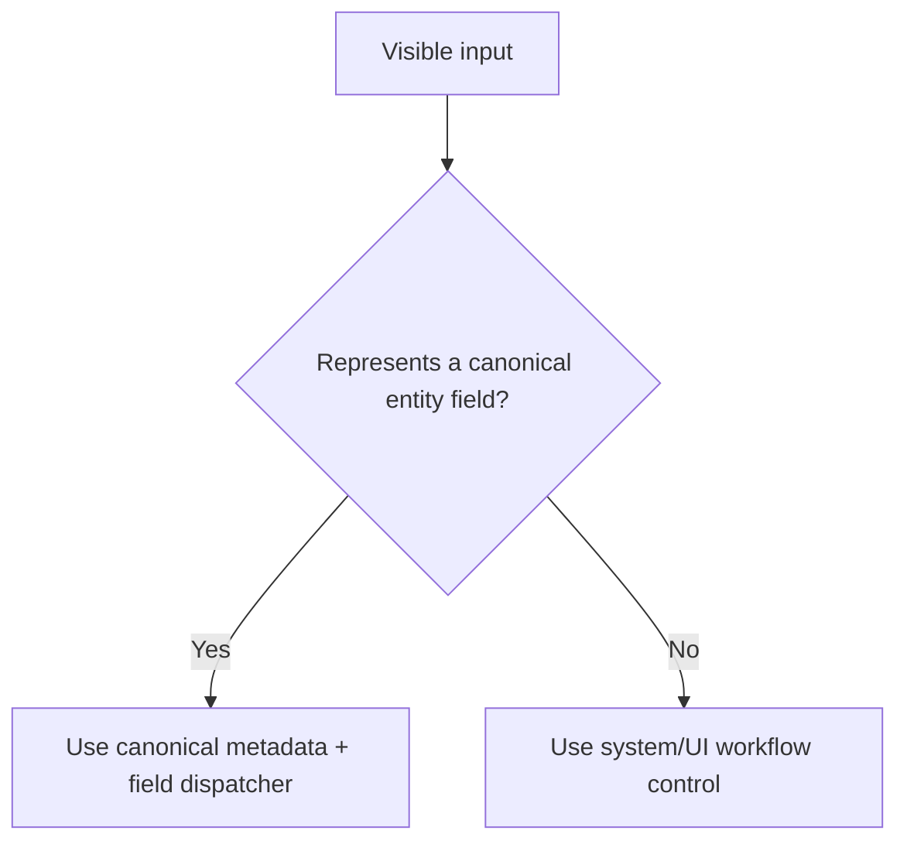

# System and Non-Entity Pages

## Purpose

Not every ManatOS surface is a metadata-driven SysBO CRUD page. Authentication, Account details, Preferences, debugger/API traffic and other framework/system experiences have different page-level responsibilities. They may still reuse the same lower-level UI components and canonical metadata where appropriate.

## Classification



The distinction prevents forcing every page through the entity-form engine while also preventing system pages from reimplementing canonical entity presentation when they display entity-backed information.

## Account details

Account details is a system/user experience, not a second SysUser editor. It can consume/reuse SysUser metadata and reusable authentication/external-identity presentation, but page composition and available actions differ from Administration → Users.

```text
Account details
├── General              read-oriented account summary
├── Authentication       auth summary + external identities + password action
├── System details
└── Debugging             developer mode
```

When the same external identity is shown in Account and User Administration, canonical provider/entry presentation must remain identical. The page must not manufacture its own icon/name rules.

## Authentication pages

Sign in, sign up, password reset/change and external-provider flows are security workflows rather than entity CRUD forms. They own workflow-specific validation, CSRF/session interaction and navigation while reusing shared auth components such as password rules where appropriate.

## Debugging/developer UI

CTX Viewer, API Traffic and debugging CLI/panels are developer-system surfaces. They own inspection, navigation, persisted-in-session UI state and developer interactions. They do not participate in business entity field semantics.



## Preferences/configuration

Preferences and configuration surfaces may use reusable controls but are not automatically canonical entity fields. Use field components only when the underlying semantic item truly is a canonical SysBO field; otherwise use system/UI components appropriate to the setting.

## Reuse rule

System pages may reuse metadata and components without pretending to be entity forms. The ownership test remains the same:

- entity field semantics → field component;
- several canonical fields as one visual construct → composite component;
- system workflow/non-field content → reusable UI/system component;
- page lifecycle/navigation/security workflow → system page/controller infrastructure.

## System/workflow inputs versus entity fields

System pages and workflow components frequently contain controls that look like form fields but are not canonical entity fields. Do not classify them by appearance.



Examples of non-entity controls include sign-in credentials, password-reset values, search terms and transient external-provider secrets. They belong to their owning system/workflow component. They do not receive entity field-tools or `ctx.page.page.fields` bindings unless a future canonical metadata model explicitly makes them entity fields.
