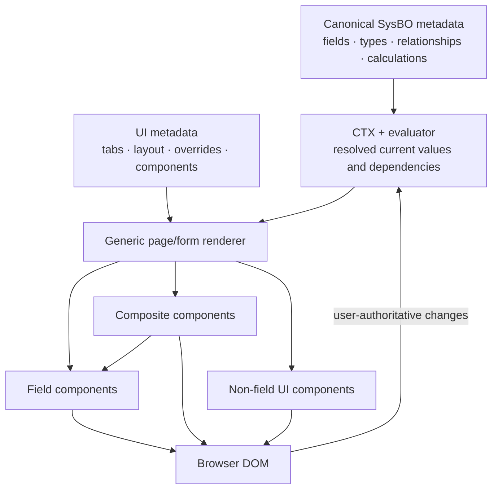
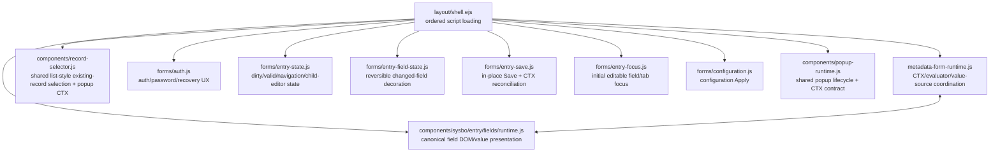
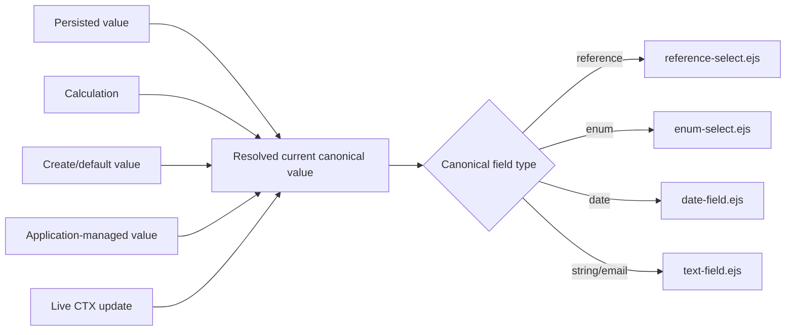
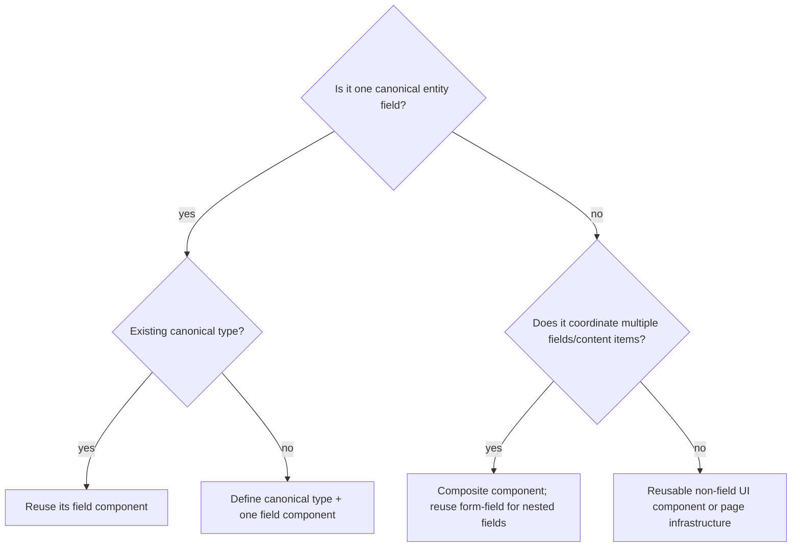
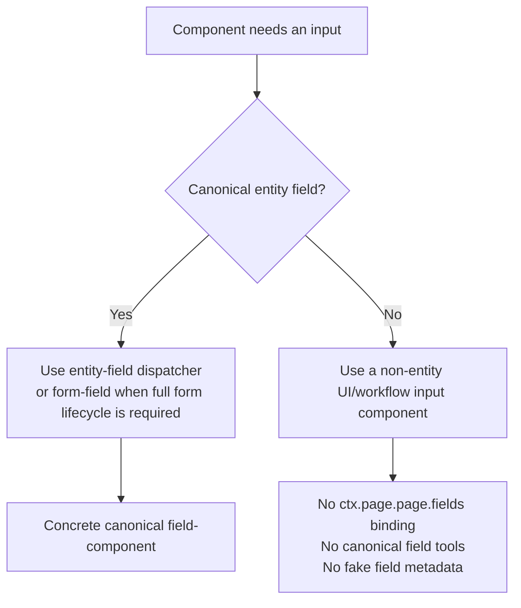

# UI Architecture and Responsibility Boundaries

## Architectural model

ManatOS separates business semantics, current context, page composition and concrete rendering. The UI consumes canonical SysBO metadata plus UI metadata; it must not reconstruct business semantics in entity-specific templates or routes.



## Architectural invariants

1. **Canonical field type determines the field component.** A field's value source never chooses a renderer.
2. **Value-source semantics are independent of presentation.** Persisted values, calculations, defaults, application-managed values and live CTX updates converge on the same canonical field.
3. **One canonical field has one field UI implementation.** There is no parallel `calculated-field`, entity-specific reference renderer, or special readonly renderer for the same type.
4. **Routes/data access remain presentation-neutral.** They load domain data and metadata; they do not manufacture UI-only icon/name strings when canonical presentation infrastructure can resolve them.
5. **UI metadata composes; it does not redefine business semantics.** Tabs, spans, component options and presentation overrides belong there. Field type, relationships and calculations remain canonical.
6. **Composite components reuse canonical fields.** A visual group may coordinate fields but must not clone their validation, value resolution or control implementation.
7. **CTX/evaluator owns evaluation, not DOM reconstruction.** Programmatic updates flow through field-component runtime APIs.
8. **Generic behavior is protected generically.** Infrastructure behavior should be covered by contract/regression tests rather than entity-key branches.

## Responsibility boundaries

```text
metadata declares       CTX/evaluator resolves       renderer composes
       │                         │                         │
       └──────────────┬──────────┴──────────────┬──────────┘
                      ▼                         ▼
             canonical field UI          non-field/composite UI
                      │                         │
                      └─────────────┬───────────┘
                                    ▼
                                  DOM
```

### Canonical metadata

Owns field definitions, canonical type, constraints, calculations, relationship targets and persistence semantics. It must be usable by clients other than the website UI.

### UI metadata

Owns presentation composition: tabs, content order, spans, presentation overrides, reusable component declarations/options/bindings and entry/list presentation policy. It must not create a second definition of a semantic field.

### CTX and evaluator

Own current values, compiled expression evaluation, dependencies and change propagation. Calculated fields become ordinary resolved field values before concrete field presentation. The evaluator does not know how an enum menu, reference selector or date control is rendered.

### Page/form infrastructure

Owns page structure, tab selection, form transaction state, validation aggregation, dirty state, save/close/delete orchestration and composition of fields/components. It delegates canonical field UI to the field-component pipeline.

### Field components

Own the complete UI contract for one canonical field type: current value display, editing, readonly presentation, type formatting, canonical icon/label representation, validation presentation, DOM/CTX synchronization and the field tool menu. They do not evaluate business calculations or persist entities.

### Composite and non-field components

Composite components coordinate several canonical fields/content items. Non-field components implement reusable UI that is not a canonical field. Neither may introduce parallel field semantics.

## Browser runtime ownership

The browser runtime is intentionally decomposed by responsibility. No single catch-all form script owns page lifecycle, field presentation and evaluator behavior.



The boundary is semantic:

- `metadata-form-runtime.js` may know canonical field values, calculation/dependency metadata and CTX paths, but it must not know enum/reference DOM representation.
- `components/sysbo/entry/fields/runtime.js` may know how a canonical field component synchronizes its DOM and option/reference presentation, but it does not evaluate business expressions or own the page transaction.
- `components/record-selector.js` owns generic existing-record browsing/selection and the live `popup.callingParams`/selector state projection; precompiled selector UI-policy expressions consume `callingParams` through the canonical evaluator, while caller-specific relationship or field semantics stay with the caller.
- the focused `forms/*` modules own page/form lifecycle concerns only. They must not grow type-specific field rendering or evaluator responsibilities.

This decomposition is part of the architecture, not merely file organization. Regression tests intentionally protect the ownership boundaries.

## Value-source independence



The left side can evolve without multiplying the right side. This is the primary anti-spaghetti rule for metadata-driven forms.

## Decision rule for new UI code



## Canonical-field embedding versus workflow inputs

A reusable UI/composite component may need controls of its own. The first question is whether the value is a **canonical entity field**.



This distinction is mandatory. A transient secret, search box, confirmation value, CLI input or other workflow-local value must not be invented as a fake canonical field merely to reuse an entity field-component. Conversely, a canonical field embedded in a compact or composite editor must still go through `entity-field.ejs`; callers must not include `text-field.ejs`, `reference-select.ejs`, etc. directly.
