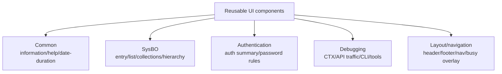
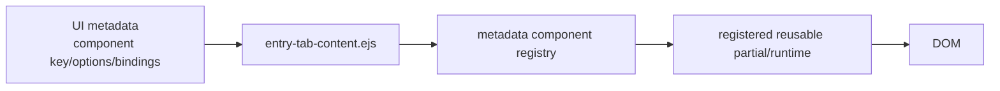
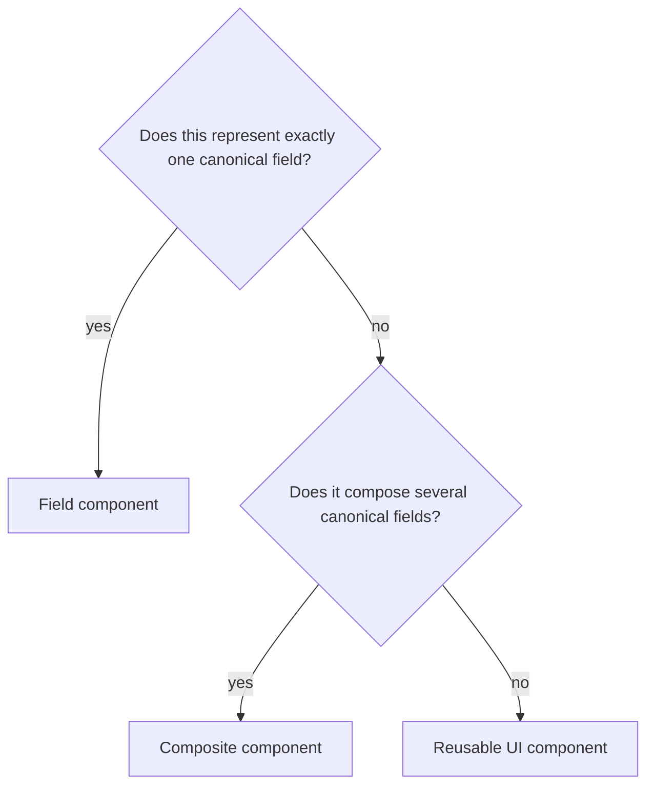
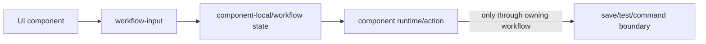
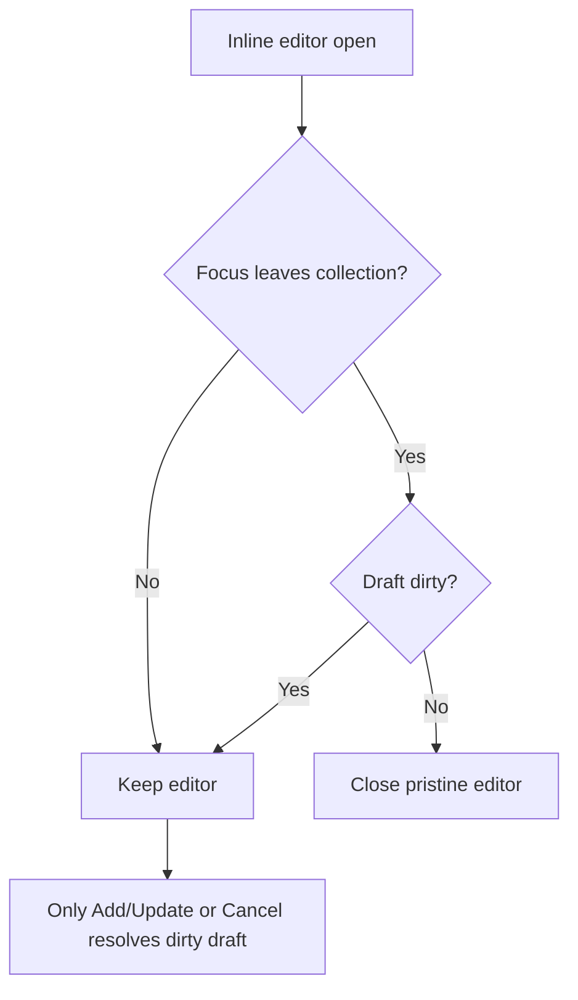

# Reusable UI Components

## Purpose

UI components are reusable presentation/interaction units that are **not themselves canonical entity fields**. They keep repeated page behavior out of entity-specific templates while remaining distinct from the field-component system.

## Component families in the current UI



Representative implementation locations include `ui/views/components/common/`, `components/sysbo/`, `components/auth/`, `components/debugging/`, `components/layout/` and `components/navigation/`.

## Responsibilities

A reusable non-field component may own:

- presentation and interaction for a non-field concept;
- rendering a related collection or hierarchy;
- a reusable panel, toolbar, navigation or status/workflow surface;
- component-local browser interaction and transient UI state;
- metadata-declared options/bindings;
- delegation to canonical field components when it embeds actual entity fields.

It must not own:

- a second definition of canonical field type/value semantics;
- business calculation evaluation;
- entity-specific display hacks that belong in metadata or generic representation infrastructure;
- persistence decisions that belong to the page/domain/API layer.

## Metadata component dispatch



The registry is intentional. Generic renderers use stable semantic component keys; they do not derive filenames from entity names or arbitrary metadata strings.

## Related collections

`related-collections.ejs` is the model for multi-entry relationship presentation. It renders domain rows using canonical entry representation metadata. Entry icon/name rules are centralized rather than rebuilt by every owner entity.

```text
owner entry
└── related collection component
    ├── related entity metadata / entry representation
    ├── relationship data rows
    └── canonical row presentation + navigation
```

Current examples include User/Account external identities and Principal/Application license relationships. The owner page may differ, but the representation rule must not.

## Hierarchy/workspace components

Hierarchy components (`hierarchy-workspace`, `record-quick`) present organization/tree interactions over domain relationships. They consume metadata and records but do not redefine Principal field/reference semantics.

## Debugging components

CTX Viewer, API Traffic, debugging panels and CLI components are system/developer UI. They own debugging interaction and visualization, not entity-field semantics. Their state/lifecycle rules are documented with the system UI rather than embedded into business entity definitions.

## Choosing UI component vs field component



## Workflow-input components

Non-entity UI sometimes needs ordinary input controls: transient secrets, search/filter terms, confirmation values, test parameters, CLI text and similar workflow-local state. These are **UI inputs, not entity field-components**.

`views/components/common/workflow-input.ejs` is the small reusable server-rendered input primitive for such transient/system workflows where an ordinary Bootstrap input is appropriate. It intentionally does not:

- read canonical `fieldDefinition` metadata;
- bind `data-ctx-field` into `ctx.page.page.fields`;
- expose the canonical field-tools menu;
- claim persistence, calculation or validation semantics belonging to entity fields.



The External Authentication Provider credential editor is the model example: `clientId` is a canonical entity field and therefore goes through `entity-field.ejs`; plaintext `clientSecret` is transient workflow state and therefore uses the non-entity workflow input.


## Inline collection-editor focus semantics

The reusable collection editor owns a local child draft until Add/Update or Cancel. Focus movement is not a persistence command. To keep the form compact without risking data loss, a pristine open editor closes when interaction focus genuinely leaves that collection, while a dirty editor remains open. Focus transitions inside the collection (including dropdown menus) do not close it.



This behavior is generic to the collection component; Contact entity metadata does not implement its own blur/focus rules.
