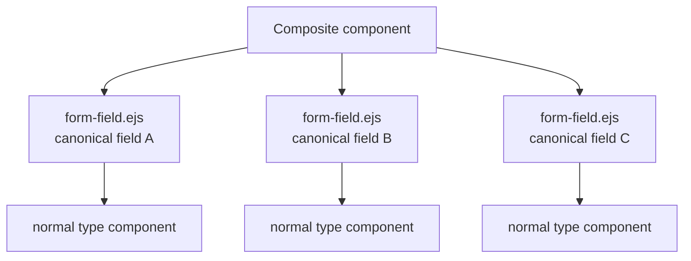
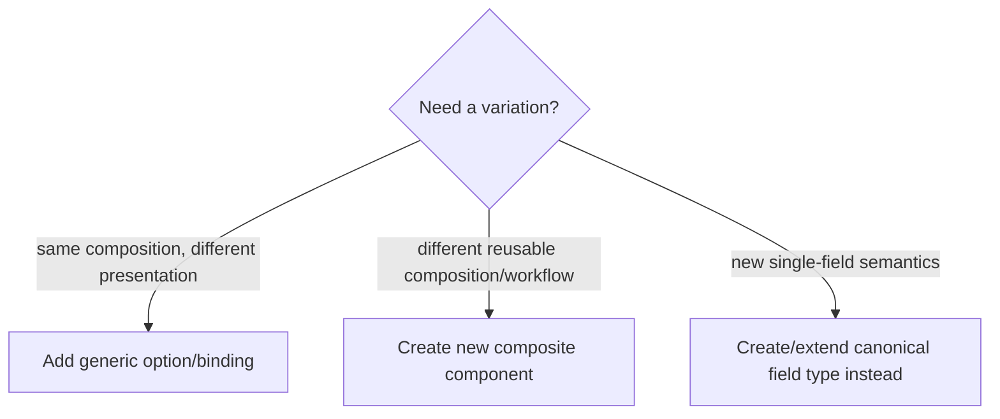

# UI Composite Components

## Purpose

A composite component is a higher-level reusable UI unit that arranges or coordinates **multiple canonical fields and/or content items** without creating a new canonical field type or value model.

## Core rule



The composite owns **composition**. Each nested field continues to own its ordinary field semantics through the normal `form-field -> entity-field -> concrete component` pipeline.

## Responsibilities

Composite components may own:

- layout and grouping of constituent fields;
- shared explanatory text, headings and visual structure;
- coordination/workflow between constituent controls where the semantics are presentation-level;
- component options/bindings that customize arrangement;
- compact/summary presentation of a group when it still consumes canonical values.

They do not own:

- cloned field definitions;
- alternative calculation/value resolution;
- duplicated validation/parsing for constituent field types;
- a second reference/enum/date/text renderer;
- entity-specific branches when a generic parameter can express the variation.

## Current model: date-duration-range

The License Contents tab provides the acceptance example. `date-duration-range.ejs` composes `validFrom`, `validityDuration` and `validUntil` but renders each constituent canonical field through `form-field.ejs`.

```text
┌──────────────────────────────────────────────────────────┐
│ Valid from                 Validity duration             │
│ [ date-field ]             [ duration-field ]            │
│                                                          │
│ Valid until                                               │
│ [ date-field ]                                            │
└──────────────────────────────────────────────────────────┘

composition owns arrangement
fields retain canonical type/value/tool behavior
```

## Summary as higher-level composition

`summary` is also a higher-level read-only presentation container. It may customize compact formatting, tones/icons or empty-value behavior, but it must consume the same resolved canonical field values. A calculated field must not trigger an alternative summary renderer.

## Parameters versus new components

Prefer component options/bindings when the difference is presentation policy: layout, heading, compactness, column widths, visible supplemental content or similar. Introduce a new component only when the composition/workflow itself is semantically different.



## Canonical fields inside composite components

Composite components arrange or coordinate content; they do not gain permission to bypass canonical field rendering. There are two valid embedding patterns:

```text
composite component
├─ canonical field needing normal form envelope
│    └─ form-field.ejs → entity-field.ejs → concrete field-component
├─ canonical field with component-owned draft/binding lifecycle
│    └─ entity-field.ejs → concrete field-component
└─ non-entity/transient workflow value
     └─ ordinary UI/workflow input component
```

`date-duration-range` uses the first form because its fields remain ordinary CTX-bound entity fields. `record-quick` uses the second because it owns a draft record transaction. Provider credentials deliberately use both the second and third forms: canonical `clientId` remains a canonical string field, while the plaintext secret is transient workflow state.

This separation prevents composite components from becoming hidden alternative field systems.
