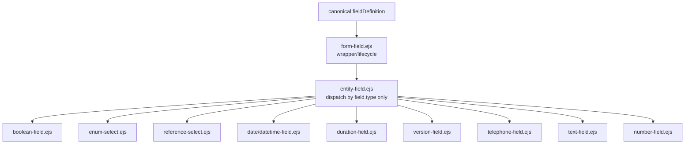
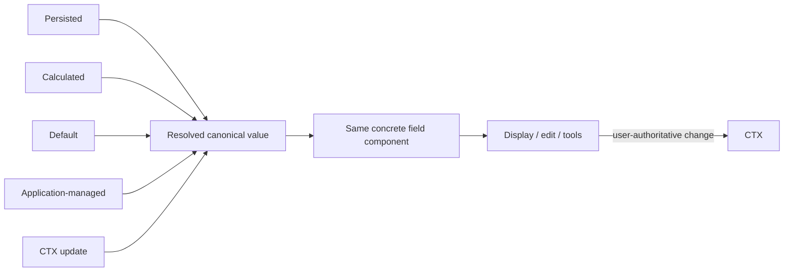
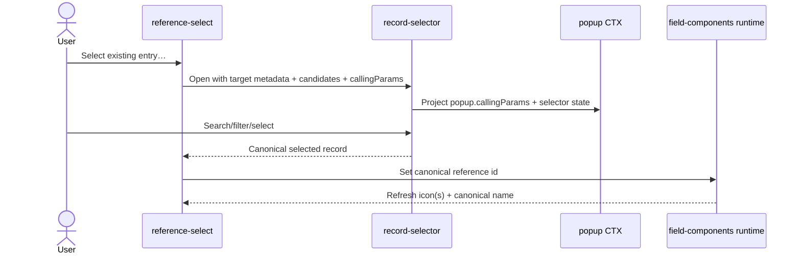
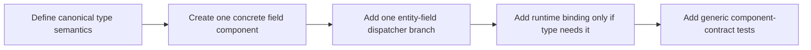
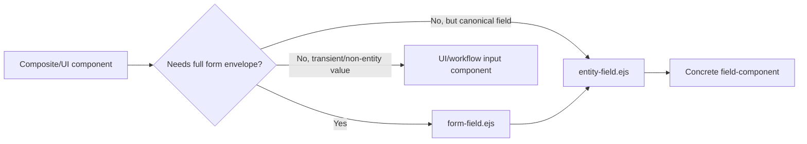

# UI Field Components

## Purpose

Field components are the single reusable presentation/interaction implementation for canonical entity fields.

> **Canonical field type determines the component. Value-source semantics determine only how the component receives or updates its value.**

A `reference` uses `reference-select.ejs` whether its value came from persisted data, a canonical calculation, a default, application-managed state or a live CTX update.

## Rendering pipeline



## Responsibility split

### `form-field.ejs` — wrapper/lifecycle

Owns the common field envelope: label, required marker, grid span, visibility/editability state, help text, runtime metadata attributes, calculation metadata needed by the generic scheduler and readonly submission support. It delegates actual type rendering.

### `entity-field.ejs` — canonical type dispatcher

Owns exactly one decision: **which concrete component corresponds to `field.type`?** It must not inspect calculation, persistence, entity key, value provenance or business-specific metadata to select a renderer.

### Concrete field component — complete type UI

A concrete field component owns the whole UI contract of its canonical type:

- receive/use the resolved current canonical value;
- render editable and readonly forms of that same type;
- type-specific formatting and parsing/presentation behavior;
- canonical label/icon presentation of selectable values where applicable;
- native control plus enhanced presentation synchronization;
- type-specific validation presentation;
- DOM ↔ CTX synchronization through field-component runtime support;
- the field tool-menu surface and which tools are meaningful/mutating for that type/state.

It does **not** own business calculation evaluation, entity persistence, page dirty-state orchestration or tab/layout composition.

## Value resolution and display



The field component is responsible for **presenting the resolved value correctly**, not for deciding how a calculation is evaluated. The CTX/evaluator resolves value-source semantics; the field component owns the canonical visual/interaction semantics of its type.

## Field tools

`field-tools-menu.ejs` is the shared tool-menu surface used by field components. Tool availability is a field-level presentation/interaction concern. Examples include Copy current value, Clear selection where mutation is allowed, and inspection/debugging actions when enabled.

```text
field component
├── primary type control/presentation
└── field tools
    ├── non-mutating tools (e.g. Copy/Inspect)
    └── mutating tools (only when field state/type permits)
```

Readonly is interaction state, not a field type. A readonly reference still uses the reference component and can retain non-mutating tools; mutating tools such as Clear selection must be disabled/absent.

## Reference fields

`reference-select.ejs` owns the universal related-entry presentation rule:

```text
canonical referenced-entry icon(s) + canonical entry name
```

The same rule applies to the selected value, menu options and readonly reference presentation. For typed Principals, for example, the entry representation may combine the entity identity with the Principal type identity. `None` / `Choose...` remain intentionally iconless. Routes/entities must not reconstruct this presentation themselves.

### Reference value lifecycle

A reference field's canonical value is an identifier. The identifier itself is never the user-facing presentation. `reference-select.ejs` and its field-component runtime own the complete mapping from that canonical identifier to the referenced entry representation. This rule applies identically to initial server rendering and later live updates caused by selection, CTX propagation or calculation.

```mermaid
flowchart LR
    V[Canonical reference id] --> R[reference field component]
    M[Reference option metadata] --> R
    R --> P[Entry icon(s) + canonical entry name]
    C[Loaded / selected / calculated / defaulted] --> V
```

The hidden native option catalogue carries the same canonical entry-name/icon metadata used by the visible selector. Runtime updates resolve presentation from that catalogue; they must never fall back to displaying a GUID merely because the value changed after initial rendering. Entity-specific or calculation-specific code must not perform this translation.

### Selecting from the generic record browser

Editable reference fields expose **Select existing entry…** through their field-tools menu when canonical target metadata is available. The field component does not implement its own list popup; it invokes the generic [existing-record selector](UI-Components.md#existing-record-selector).



The popup invocation identifies the source entity/record and target field in `callingParams`. The selected record id still flows through the same reference-component value path as direct dropdown selection or evaluator-driven updates.

## Enum fields

`enum-select.ejs` owns enum option and selected-value presentation. Labels, icons, tones and traits come from canonical enum metadata. The same option representation is used in the selector and elsewhere generic enum presentation is requested. Entity templates must not render enum icons independently.

## Other current canonical field types

| Type         | Component responsibility highlights                   |
| ------------ | ----------------------------------------------------- |
| boolean      | switch/boolean state and readonly representation      |
| string/email | text input/display; email semantics from metadata     |
| number       | numeric control/format and numeric synchronization    |
| date         | date value/control and date-specific tools/format     |
| datetime     | datetime value/control and formatting                 |
| duration     | canonical duration editing/presentation               |
| version      | structured version editing/presentation               |
| telephone    | telephone-specific presentation/input behavior        |
| enum         | metadata option label/icon/tone + selection           |
| reference    | related-entry lookup, canonical icon/name + selection |

## Runtime binding

CTX/evaluator infrastructure resolves calculations and dependencies. `metadata-form-runtime.js` schedules/propagates generic changes but must not reconstruct field-specific DOM. Programmatic field updates are delegated to `window.ManatOSFieldComponents.setFieldValue(...)` in `components/sysbo/entry/fields/runtime.js`, which synchronizes the canonical control and enhanced type-specific presentation.

## Adding a field type



Do not add entity-specific renderer branches or a second renderer for calculated/readonly values of an existing type.

## Forbidden patterns

- selecting a component because a value is calculated/derived/persisted/defaulted;
- a parallel `calculated-field` renderer that imitates canonical types;
- entity-specific reference/enum rendering;
- routes decorating rows with UI-only icon/name facts when metadata/presentation infrastructure can resolve them;
- evaluator code reconstructing enum/reference/type-specific DOM;
- defining the same semantic field once canonically and again in a parallel UI catalogue.

## Embedding canonical fields outside the standard form grid

`form-field.ejs` is preferred when a canonical field participates in the ordinary entry-form lifecycle. Some higher-level components legitimately embed a canonical field without the normal form envelope. `record-quick.ejs` and the provider credential workflow's canonical `clientId` are examples.

In that case the component may invoke **`entity-field.ejs` directly**, supplying the canonical field metadata and resolved value. It must still never include a concrete field-component directly.



When an embedded canonical field is owned by a local draft/workflow rather than `ctx.page.page.fields`, it may use `bindCtx: false`. That changes the **binding owner**, not the field's type or renderer. The same canonical type dispatcher/component is still used.

### What must never happen

- A UI component must not include `text-field.ejs`, `reference-select.ejs`, `enum-select.ejs`, or another concrete field-component directly.
- A transient workflow value must not be given fake canonical field metadata merely to obtain a field component or field-tools menu.
- A locally owned canonical draft field must not silently bind itself to the page entry CTX; use the dispatcher with explicit local ownership.

## Source authoring convention

Every field-component EJS file follows the common ManatOS component source-header and
layout convention documented in [UI-Component-Authoring.md](UI-Component-Authoring.md).
The header makes purpose, metadata inputs, CTX binding, embedded components, and browser
runtime hooks explicit. This is an authoring/documentation contract only; canonical field
behavior remains metadata/runtime driven.
