# ManatOS UI Flows

## Purpose

This guide documents the **supported end-to-end UI flows** that exercise the page, form, field-component, composite-component and system-surface architecture described elsewhere under `docs/ui/`.

It is intentionally flow-oriented: each section answers **which screens participate, what owns each step, where state lives, and which reusable UI contracts are involved**. Use it together with:

- [`UI-Architecture.md`](UI-Architecture.md) for architectural boundaries and invariants;
- [`UI-Forms.md`](UI-Forms.md) for form lifecycle, dirtiness, validation and Save/Close behavior;
- [`UI-Field-Components.md`](UI-Field-Components.md) for canonical field rendering and field tools;
- [`UI-Components.md`](UI-Components.md) for reusable non-field widgets and collections;
- [`UI-Composite-Components.md`](UI-Composite-Components.md) for multi-field/content composition;
- [`Entity-Pages.md`](Entity-Pages.md) for current metadata-driven entity page models;
- [`System-Pages.md`](System-Pages.md) for authentication, account, configuration and developer/system surfaces.

## Flow map

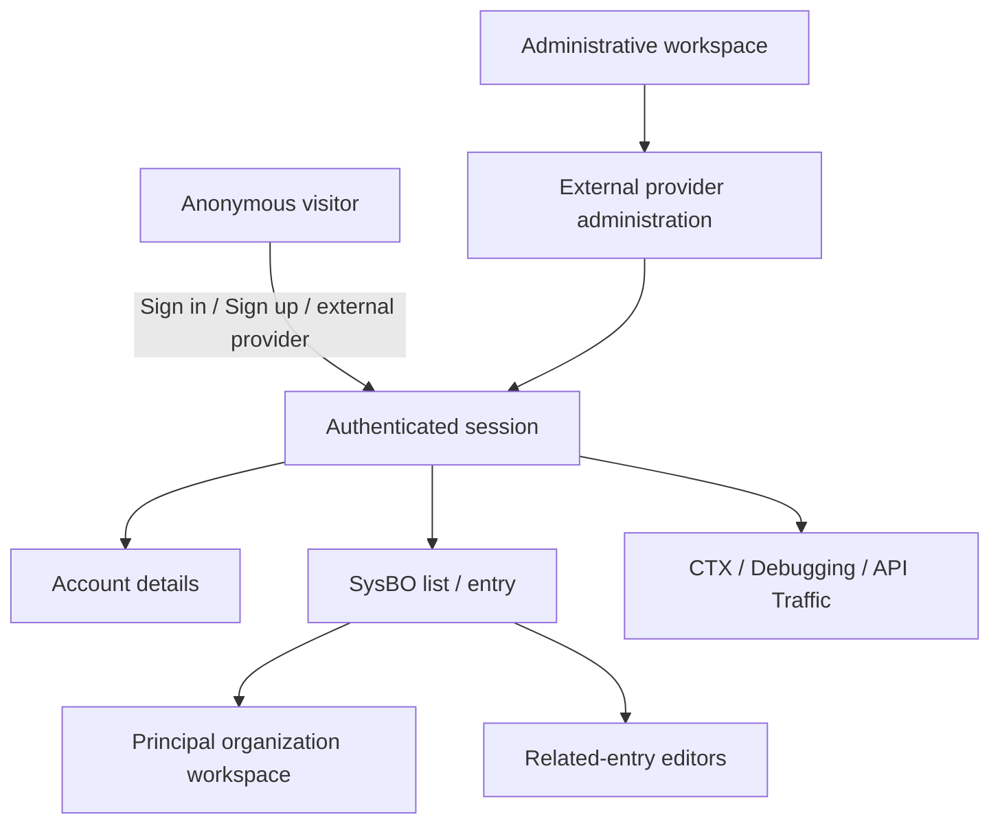

The flows share one important rule: **page/workflow state may differ, but canonical entity fields always retain the same field-component semantics**. A reference does not gain a second renderer because it was calculated; an enum does not gain an entity-specific menu because it appears in a special workflow.

---

## 1. Local authentication flow

### Screens and components

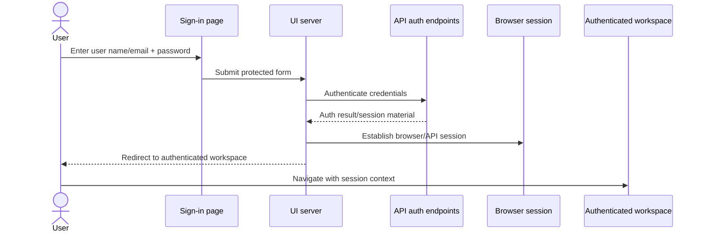

The authentication page is a **system page**, not a metadata-driven entity entry form. Password visibility and password-policy behavior belong to reusable system/form infrastructure, not to SysBO field components. See [`System-Pages.md`](System-Pages.md) and the system-input guidance in [`UI-Components.md`](UI-Components.md).

### Responsibilities

- **Sign-in page**: captures credentials and displays validation/errors.
- **UI authentication route/session layer**: orchestrates browser-session establishment.
- **API**: remains authoritative for authentication/security decisions.
- **Application shell**: changes anonymous actions into authenticated navigation/account actions after session establishment.

---

## 2. Registration and verification flow

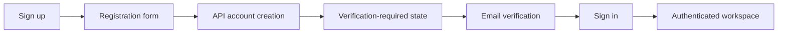

Registration uses system-page controls and shared password-policy behavior. The resulting SysUser later appears through the normal metadata-driven Users administration pages; **registration UI and SysUser administration are different presentation/workflow layers over related business data**.

For the metadata-driven User entry model, see [`Entity-Pages.md#users`](Entity-Pages.md#users).

---

## 3. External authentication flow

### User-facing provider sign-in

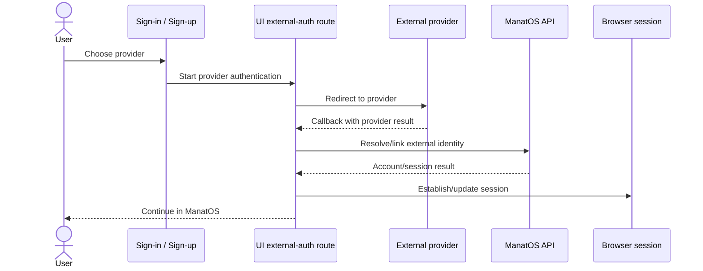

Provider-specific protocol/adapters belong to authentication infrastructure. The resulting external identity is presented in Account/User Authentication through reusable summary/related-entry presentation rather than provider-specific User templates.

### Administrative provider credential flow

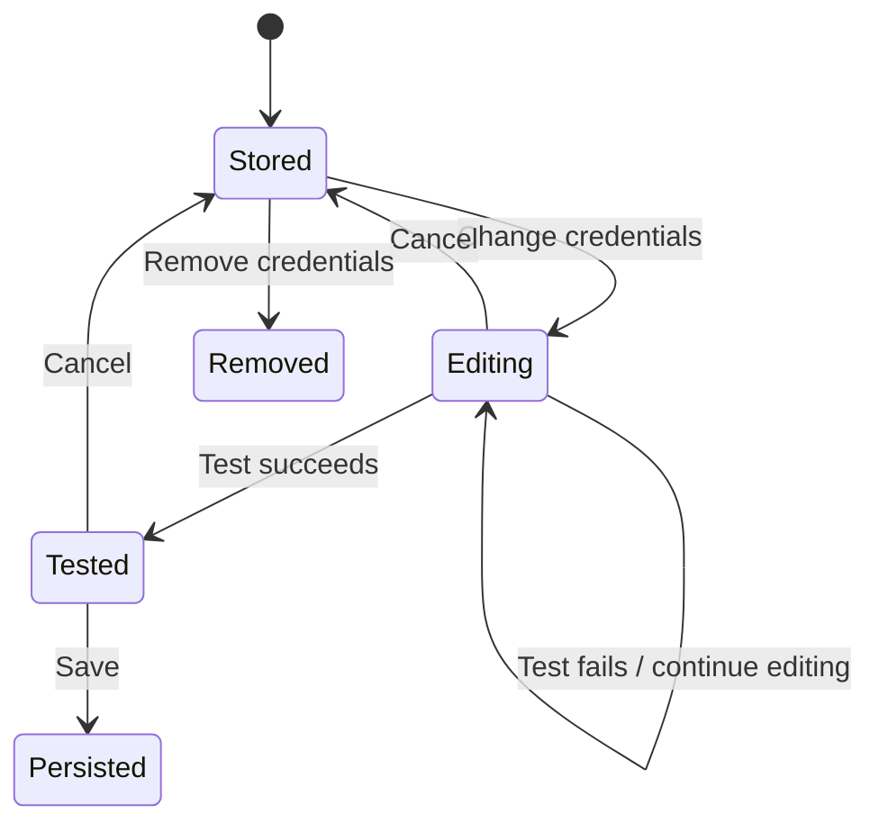

The External Authentication Provider entry intentionally mixes two kinds of values:

- **Client ID** is a canonical entity field and therefore goes through the canonical field dispatcher/field-component pipeline.
- **Client secret** is transient credential workflow state and therefore uses a non-entity workflow input. Plaintext secret material is intentionally never returned after persistence.

Credential testing validates the pending screen state; **Save is the persistence boundary**. See [`System-Pages.md`](System-Pages.md) and [`UI-Components.md`](UI-Components.md).

---

## 4. Account-details flow

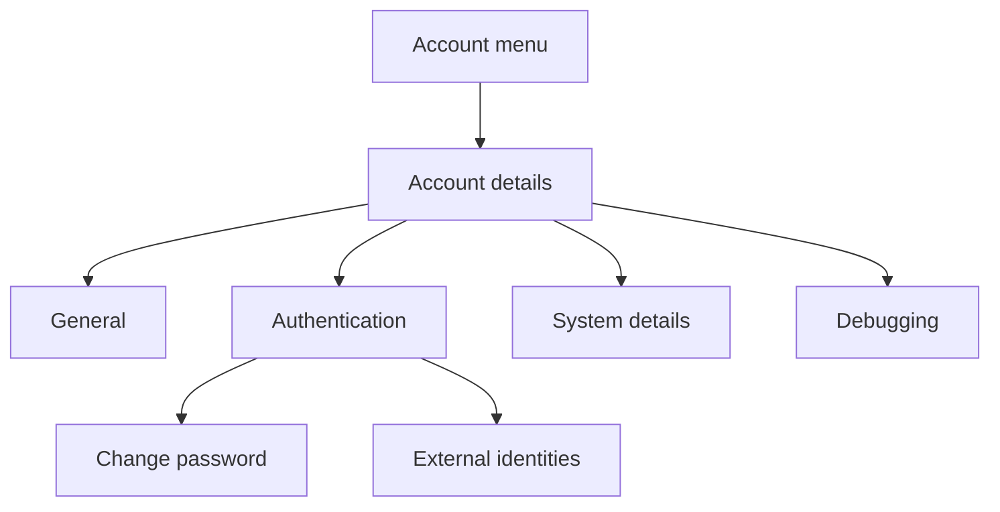

Account details reuse metadata/entity presentation where appropriate but remain an **account/system surface**. Authentication summary content and external-identity presentation should therefore reuse the same canonical/reusable UI behavior as User administration without cloning User-specific renderer logic.

See [`System-Pages.md`](System-Pages.md) for the surface boundary and [`UI-Components.md`](UI-Components.md) for reusable non-field summary/collection behavior.

---

## 5. Generic SysBO administration flow

This is the model flow for Users, Principals, Applications, Licenses and future metadata-driven entities.

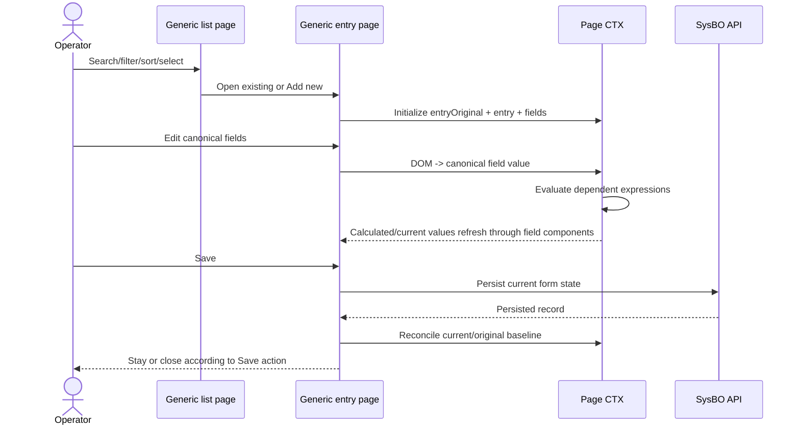

### Entry state contract

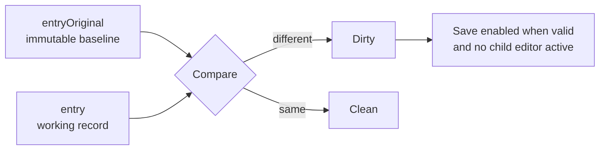

The form lifecycle is documented in detail in [`UI-Forms.md`](UI-Forms.md). Canonical field rendering is documented in [`UI-Field-Components.md`](UI-Field-Components.md).

### Changed-field feedback

Direct edits and evaluator-driven changes use the same reversible visual rule:

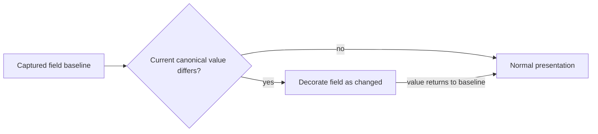

A calculated field may therefore become visually changed because one of its dependencies changed, without becoming a different kind of field component.

---

## 6. Principal reference recalculation flow

Principals provide the strongest current example of direct and calculated references sharing one presentation pipeline.

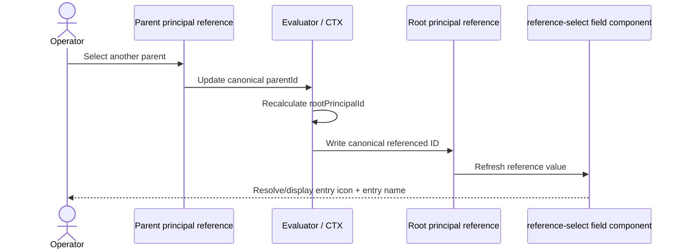

The canonical value of the calculated reference may be an ID, but the user-facing representation remains the same canonical reference presentation used for direct values. See [`UI-Field-Components.md`](UI-Field-Components.md).

---

## 7. Related-entry collection editing flow

Contact collections demonstrate child-editor ownership inside a parent entity page.

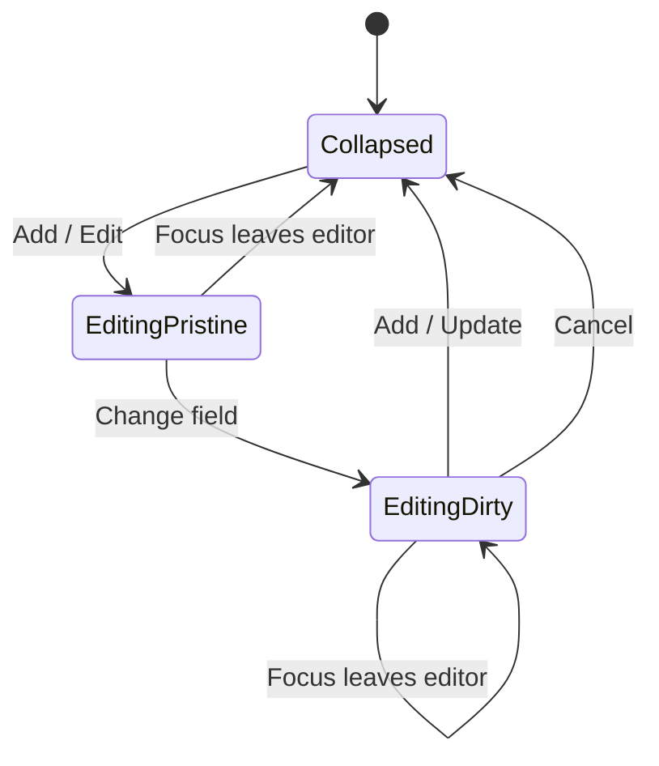

The parent entry cannot save while a child editor is active. Focus leaving a **pristine** child editor may close it automatically; a **dirty** child editor remains open so focus movement never silently commits or discards data.

Structured child fields can themselves use canonical field semantics/options, while the collection component owns draft lifecycle, Add/Update/Cancel and the relationship to the parent record. See [`UI-Components.md`](UI-Components.md) and [`UI-Composite-Components.md`](UI-Composite-Components.md).

---

## 8. Principal Organization workspace flow

The Organization tab is an owner-managed hierarchy workspace rather than ordinary scalar form fields.

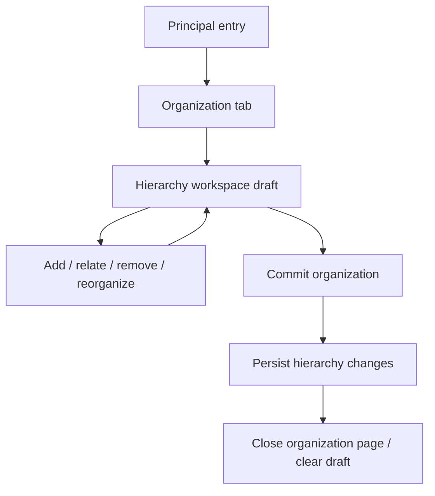

The hierarchy workspace owns its transactional graph/draft behavior. Quick-record editors inside it may render canonical entity fields through `entity-field.ejs`, but the workspace — not those field components — owns the draft transaction and final Commit operation.

---

## 9. License validity assisted-calculation flow

License Contents demonstrates editable assisted calculation rather than an alternative field renderer.

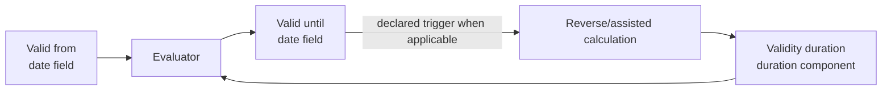

Date and duration remain their normal canonical types. The date-duration composite coordinates layout/interaction; calculation metadata controls value causality. See [`UI-Composite-Components.md`](UI-Composite-Components.md).

---

## 10. Debugging and CTX inspection flow

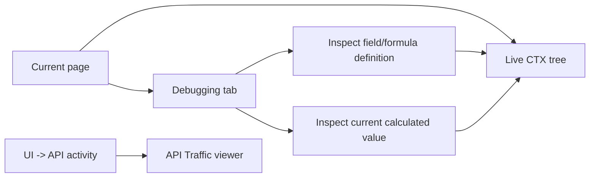

The developer surfaces expose current implementation provenance rather than creating another business/presentation model. Formula-definition inspection and current-value inspection intentionally answer different questions.

See [`System-Pages.md`](System-Pages.md) and the broader debugger/context architecture documentation outside this UI guide.

---

## 11. Runtime trace for metadata-driven field changes

This cross-cutting trace is useful when debugging any of the administration flows above. It shows which runtime owns each stage without creating a flow-specific renderer.

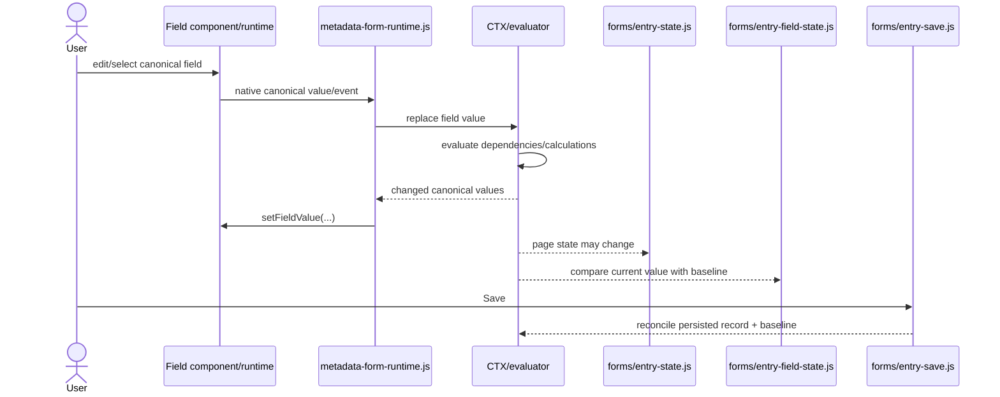

This is the generic path for direct and calculated fields. A concrete flow must not add another enum/reference/date/text presentation path simply because its value originated from a different calculation or workflow.

---

## 12. How to document a new flow

A new UI flow should document:

1. **entry point and exit/result**;
2. **pages, tabs, modals/popups and reusable components involved**;
3. **which layer owns transient state, canonical field state and persistence**;
4. **where CTX/evaluator behavior participates**;
5. **security/API authority boundaries**;
6. links to the relevant component/page architecture documents rather than re-explaining those contracts locally.

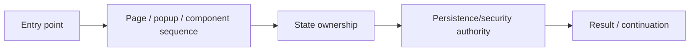

The purpose of this guide is to make supported behavior easy to trace **without encouraging flow-specific duplicates of generic UI infrastructure**.
