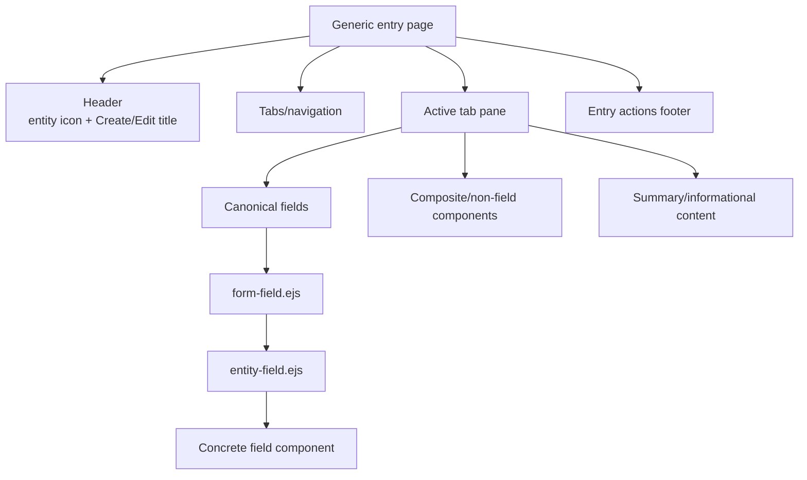
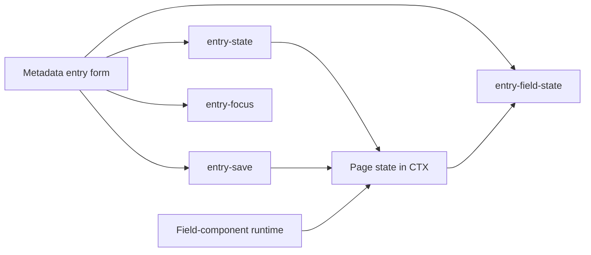
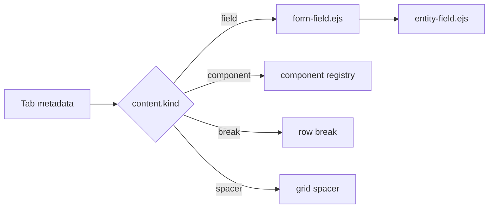
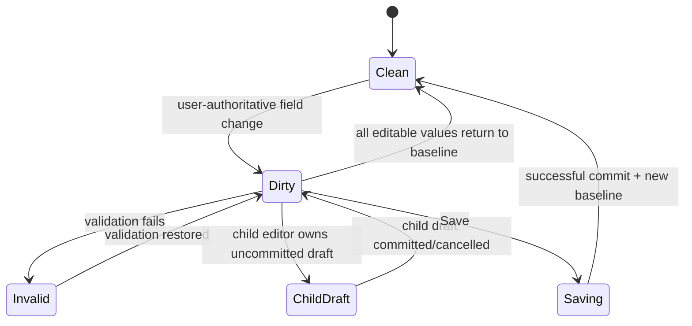

# UI Forms

## Purpose

ManatOS entry forms are metadata-composed presentation surfaces. Canonical metadata defines fields, relationships and calculations; UI metadata arranges those fields into tabs/layouts and adds presentation policy. Reusable components provide layout/workflow behavior without re-declaring field semantics.

## Form anatomy



A typical entry page therefore has one page transaction but many delegated presentation units. Save/Close/Delete are page concerns; enum/reference/date/text behavior is a field-component concern.

## Composition pipeline

```text
SysBO canonical metadata              SysBO UI metadata
(fieldDefinition, relationships)      (tabs, content, overrides, components)
              \                         /
               \                       /
                v                     v
                 generic entry renderer
                         |
                         v
               entry-tab-content.ejs
                  /              \
                 v                v
        form-field.ejs        UI component
              |             (layout/workflow/container)
              v                 |
       entity-field.ejs         +-- may compose form-field.ejs
              |
              v
       concrete field component
```

## Form infrastructure responsibilities

The generic form/page layer owns:

- entry header, breadcrumb integration and tabs;
- active-tab composition and informational/read-only tab treatment;
- page-level create/edit/view mode;
- one form transaction and baseline;
- dirty/clean and aggregate validity state;
- registered child-editor draft ownership;
- Save, split-save, Close and Delete orchestration;
- page-level focus/navigation behavior;
- passing canonical field context into `form-field.ejs`;
- rendering metadata-declared non-field/composite components through the component registry.

It does **not** own concrete type controls, reference/enum icon rendering, field calculations, relationship persistence, or entity-specific visual branches.

## Browser form-runtime modules

Form lifecycle behavior is split into focused browser modules. `layout/shell.ejs` loads them explicitly in dependency-safe order.

| Module | Owns | Must not own |
|---|---|---|
| `forms/auth.js` | password visibility, optional-local-password UX, password-policy/recovery form behavior | canonical entity-field rendering or CTX evaluation |
| `forms/entry-state.js` | form baseline, dirty/valid state, unsaved-navigation protection, Save enablement, Close/Cancel semantics, child-editor state | concrete field-type presentation |
| `forms/entry-field-state.js` | reversible per-field changed decoration from canonical current-vs-baseline values | value calculation or field-type formatting |
| `forms/entry-save.js` | metadata-entry in-place Save, persisted-record reconciliation into CTX/baselines | business persistence rules or field rendering |
| `forms/entry-focus.js` | initial editable-field discovery and tab activation | field editability semantics themselves |
| `forms/configuration.js` | progressive in-place Apply for configuration surfaces | metadata-entry transaction behavior |
| `forms/modal-focus.js` | generic Bootstrap modal focus return/accessibility lifecycle | popup business actions |



When adding browser behavior, extend the owning module or create another focused runtime only when the responsibility is genuinely distinct.

## Tab content

Tabs may contain canonical fields, reusable UI components, row breaks and spacers. `entry-tab-content.ejs` classifies and renders these content kinds. Stable component keys are resolved through the metadata component registry; entity names must not determine EJS filenames.



## Field wrapper versus dispatcher

`form-field.ejs` is the generic **form-field wrapper**. It owns the outer field container, label, visibility/editability state, normalized metadata attributes, calculation metadata needed by runtime scheduling, help text and readonly submission support.

`entity-field.ejs` is the **canonical type dispatcher**. It chooses a concrete component from `field.type` only. It must not choose a renderer based on calculation, persistence, entity key, readonly state or value provenance.

This distinction is deliberate: forms need wrapper/lifecycle concerns around every field, while type dispatch must remain a single reusable decision point.

## Form state lifecycle



Save is enabled only when the form is dirty, valid, and no registered child editor owns an uncommitted draft. Calculated/readonly changes do not independently make the form dirty.

## Summary layout

`summary` is a higher-level read-only presentation container, not an alternate field/value model. It consumes the same resolved canonical values as form layouts. Presentation overrides may add compact formatting, tones, icons or empty-value behavior, but stored versus calculated must not create different rendering pipelines.

## Related collections

Related collections are higher-level multi-entry components. Routes load relationship/domain data; canonical entity metadata and UI metadata provide entry representation. The collection/presentation boundary owns entry icon/name display rather than each entity route manufacturing display strings.

## Developer checklist

1. Define each semantic field once in canonical `fieldDefinition` with its true type.
2. Put calculations on that field's canonical `calculation` metadata.
3. Put relationships in canonical relationship metadata.
4. Use UI metadata to arrange tabs/content and presentation policy.
5. Reuse field components; never select controls in entity-specific EJS.
6. Use composite/UI components only for composition, non-field presentation or reusable workflows.
7. Keep routes/data services presentation-neutral.
8. Protect generic behavior with generic tests.
