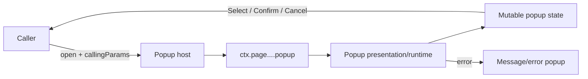

# UI Popups

## Purpose

ManatOS popups are transient UI surfaces hosted above the current page while remaining part of the live CTX tree. They are not independent mini-applications: callers provide a typed invocation contract under `popup.callingParams`, the popup owns its mutable interaction state, and results return to the caller through the popup runtime contract.

The generic rule is:

> `callingParams` describes **why and with what contract** a popup was opened; popup state describes **what is happening now**.

## Popup lifecycle



Typical CTX shape:

```text
ctx.page....popup
├── kind
├── callingParams
├── presentation
├── entriesOriginal / entries        # selectors when applicable
├── filters / search / paging        # selectors when applicable
├── selectedId / selectedIds         # selectors when applicable
└── state
    ├── phase
    ├── open
    ├── dirty
    └── valid
```

## Record-selector popup

The existing-record selector is the popup presentation used by metadata-driven entity reference fields and hierarchy/workspace operations. Although it is hosted as a popup, its entity/list semantics are documented with entity pages in [`Entity-Pages.md`](Entity-Pages.md#existing-record-selector-page-surface). This chapter documents the popup contract and lifecycle.

### Shared invocation envelope

Representative `callingParams` fields are:

| Property                                | Meaning                                                                            |
| --------------------------------------- | ---------------------------------------------------------------------------------- |
| `purpose`                               | Discriminates caller intent such as `reference-field` or `hierarchy-add-existing`. |
| `presentationMode`                      | Caller presentation intent; selector metadata resolves the concrete presentation.  |
| `entityKey`                             | Entity whose records are being selected.                                           |
| `idField`                               | Canonical identity field, normally `id`.                                           |
| `selectionMode`                         | `single` today; contract permits future selection modes.                           |
| `targetField` / `targetFieldLabel`      | Reference-field destination when the caller is a field.                            |
| `sourceEntityKey` / `sourceEntityLabel` | Entity that opened the selector.                                                   |
| `sourceRecordId` / `sourceRecordName`   | Current owning record context.                                                     |
| `relation` / `anchorRecordId`           | Relationship-placement context used by hierarchy callers.                          |
| `queryPredicate`                        | Canonical precompiled selection/exception expression supplied by the caller.       |
| `allowClear`                            | Whether the caller permits a null selection.                                       |
| `showContextNote`                       | Optional presentation policy input.                                                |
| `autofocusSearch`                       | Optional search-focus policy input.                                                |

Fields that do not apply to a caller remain null/defaulted rather than acquiring caller-specific meanings.

### Reference-field invocation example

```text
popup.kind = "record-selector"
popup.callingParams = {
  purpose: "reference-field",
  entityKey: "sys-principals",
  idField: "id",
  selectionMode: "single",
  targetField: "principalId",
  targetFieldLabel: "Principal",
  sourceEntityKey: "sys-users",
  sourceEntityLabel: "User",
  sourceRecordId: "<user-id>",
  sourceRecordName: "Admin",
  queryPredicate: <compiled canonical expression>,
  allowClear: true
}
```

The selector does not invent User/Principal policy. The canonical reference candidate contract is resolved before the popup renders. The same predicate is visible in CTX Viewer and is suitable for translation by future storage adapters.

### Hierarchy invocation example

```text
popup.callingParams = {
  purpose: "hierarchy-add-existing",
  presentationMode: "subtle",
  entityKey: "sys-principals",
  selectionMode: "single",
  relation: "sibling",
  anchorRecordId: "<principal-id>",
  queryPredicate: <compiled hierarchy eligibility expression>,
  allowClear: false
}
```

Hierarchy policy belongs to the hierarchy caller; browsing, search, filtering, paging, canonical row presentation and selection mechanics remain generic selector responsibilities.

## Message and error popups

Message popups present information, warnings and operation failures. When an operation failure originates from an API/error object, the popup should expose the transport-safe diagnostic snapshot under `popup.callingParams.error` in addition to rendering the user-facing text.

```text
popup
├── kind = "message-modal"
├── callingParams
│   ├── purpose = "message"
│   ├── popupId
│   ├── triggerId
│   └── error
│       ├── name
│       ├── code
│       ├── message
│       ├── userMessage
│       ├── retryable
│       └── operationTrace
└── presentation
    ├── mode
    └── title
```

This keeps the popup readable for an operator while making the underlying failure inspectable in CTX Viewer.

## Responsibility boundaries

A popup may own its transient UI state, presentation, keyboard/focus lifecycle and selection/confirmation interaction. It must not duplicate entity representation rules, reparse canonical expressions, invent reference eligibility rules, or perform caller-specific persistence. Those responsibilities remain with canonical metadata/evaluator/domain infrastructure and the caller.

## Entity-entry popup host

`ManatOSEntryPopup` is a generic popup **host**, not an entity form implementation. It embeds the
normal metadata-driven entity entry route and owns only modal lifecycle, caller CTX projection and
result/cancel messaging.

Its `callingParams` follow the common popup diagnostic convention and include the target entity,
source/caller identity, purpose, mode, create defaults and effective caller UI overrides when
applicable. This makes an `Add entry...` call from a reference field and a read-only entry opened from
a hierarchy node inspectable through the same CTX Viewer conventions used by the record selector.

The popup closes on caller Close/Cancel without changing the parent. A successful embedded Save posts
a same-origin `manatos:entry-popup-saved` result containing the created/updated id, record and
canonical entry representation. Consumers bind to that result rather than scraping popup DOM.
