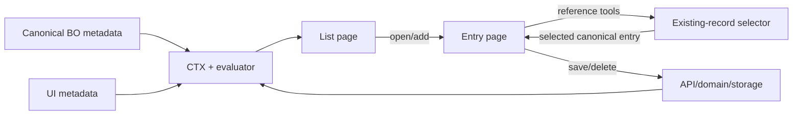

# Working with Entity Lists and Entries

## Purpose

This guide is the authoritative structural reference for metadata-driven SysBO **list pages, entry pages and the existing-record selector page surface**. These surfaces are driven by canonical BO metadata, UI metadata and CTX; entity-specific templates must not recreate field, reference, representation or query semantics.

## End-to-end page model



## 1. List page

### Presentation structure

```text
Entity list page
├── breadcrumb / page title + canonical entity icon
├── page actions
├── count
├── Filters
├── Search
├── table
│   ├── metadata-defined columns
│   ├── canonical value / entry representation
│   └── row actions
└── paging / rows-per-page
```

### Important CTX structure

```text
ctx.page
├── name                 # entity/list route identity
├── kind = "sysbo-list"
├── mode = "list"
├── fields               # list field metadata/runtime projections
├── filters              # active list filters incl. listExceptions
├── entriesOriginal[]    # canonical source snapshot
├── entries[]            # current projected result set
└── state
    ├── dirty
    ├── valid
    └── page
```

List filtering/search/sorting is a query contract, not a browser-only rendering concern. Structured exception expressions must remain canonical so a future RDBMS adapter can translate them to storage predicates.

### Calling example

Opening `/bo/sys-principals` loads the Principal BO/UI metadata, projects the declared list fields (`parentId`, `rootPrincipalId`, `name`, `principalType`, `enabled`) and renders all reference values through the same entity-aware entry representation resolver used by selectors and related collections.

## 2. Entry page

### Presentation structure

```text
Entity entry page
├── breadcrumb
├── title = Create/Edit + canonical entry representation
├── metadata-defined tabs
│   ├── form fields
│   ├── summary fields
│   ├── related collections
│   └── reusable components
└── entry actions
    ├── Delete
    ├── Close / Cancel
    └── Save / Save and Close
```

The first visible editable field in the first editable tab receives initial focus. This is determined from rendered metadata order after reactive visibility/editability initialization; no entity-specific autofocus rule is required.

### Important CTX structure

```text
ctx.page
├── ...list context when entry was opened from a list
└── page
    ├── name = "entry"
    ├── kind = "sysbo-entry"
    ├── mode = "create" | "edit" | "view"
    ├── fields
    │   └── <fieldKey>
    │       ├── value
    │       ├── option                 # enum/reference decoration when applicable
    │       ├── editable / visible     # evaluated UI state
    │       └── calculation metadata   # when applicable
    ├── entryOriginal
    ├── entry
    ├── related collections / component sources
    └── state
        ├── dirty
        ├── valid
        ├── internalEditing
        ├── internalEditorCount
        ├── saving
        └── deleting
```

### Field and calculation example: Person Principal

Principal keeps the canonical persisted `name` field but presents it as **Full name**. For `principalType == 'Person'`, `firstName` and `lastName` are visible and editable while `name` becomes read-only and is evaluator-calculated/materialized from those fields. For non-Person principals, first/last names are hidden and `name` is directly editable.

```text
Principal type        Enabled
First name            Last name       # Person only
Full name             User            # User Person only; Full name readonly for Person
Description                           # full row
Parent principal      Root principal
```

Because `Principal type` is the first control, it receives initial focus and its CTX value can drive the visibility/editability of all following fields before the user reaches them.

## 3. Existing-record selector page surface

The selector is popup-hosted, but it is documented here because it is an entity browse/select surface that deliberately reuses list-page metadata, canonical entry presentation, filters, search and paging. Popup hosting/lifecycle details are in [`UI-Popups.md`](UI-Popups.md).

### Presentation structure

```text
Record selector
├── title derived from caller/presentation policy
├── Filters
├── Search
├── canonical entity table
│   ├── same list columns
│   ├── same reference formatting/icons/names
│   └── candidate availability/selection state
├── paging
├── context note
└── Cancel / Select
```

A selector must never have a second answer for "what is this entry called?". Entity-aware canonical entry representation is the single holder of truth for list rows, reference fields, selectors, hierarchy selectors and related collections.

### Important CTX structure

```text
ctx.page....popup
├── kind = "record-selector"
├── callingParams
│   ├── purpose
│   ├── presentationMode
│   ├── entityKey / idField
│   ├── selectionMode
│   ├── sourceEntityKey / sourceRecordId / sourceRecordName
│   ├── targetField / targetFieldLabel
│   ├── relation / anchorRecordId
│   ├── queryPredicate
│   └── allowClear / showContextNote / autofocusSearch
├── presentation
│   ├── mode
│   ├── title
│   └── contextNote
├── entriesOriginal[]
├── entries[]
├── filters
├── search
├── paging
├── selectedId / selectedIds[]
└── state
```

`callingParams.queryPredicate` is a canonical precompiled expression. The browser evaluates the supplied AST; it does not reparse the source string or reconstruct caller-specific exclusions. The expression remains inspectable in CTX Viewer and transportable toward storage-side selection.

### Reference-field call example

```text
User(Admin).principalId
  -> field tools / Select existing entry...
  -> selector(entityKey = sys-principals,
              purpose = reference-field,
              targetField = principalId,
              sourceEntityKey = sys-users,
              sourceRecordId = <Admin id>,
              queryPredicate = <canonical uniqueness/eligibility expression>)
  -> selected Principal
  -> reference field value + CTX update
  -> ordinary Save transaction
```

### Hierarchy call example

```text
Organization workspace / Add existing entry...
  -> selector(entityKey = sys-principals,
              purpose = hierarchy-add-existing,
              relation = sibling|child|...,
              anchorRecordId = <principal id>,
              queryPredicate = <hierarchy eligibility expression>)
  -> selected Principal
  -> hierarchy draft relation
  -> Commit
```

## Current reference entities

### Users

Users model ordinary editable text/contact fields, metadata-driven enum selection, calculated/readonly fields, the optional one-to-one Principal reference, authentication summary content and external identities.

### Principals

Principals are the strongest reference/reference-field and hierarchy model. Their General tab demonstrates conditional field visibility/editability, an assisted persisted Full-name calculation, inverse one-to-one User reference selection, editable Parent and calculated Root references, and initial focus driven entirely by metadata order.

### Applications

Applications are the compact baseline SysBO model and demonstrate straightforward metadata-driven entry/list behavior plus related Licenses.

### Licenses

Licenses demonstrate reference, enum, numeric, date, duration and version-like structured field presentation. The Contents tab is the model for date-duration composition and reference selection to Applications.

## Responsibility checklist for new entity surfaces

A new entity should normally require metadata, not a new renderer. Before adding entity-specific code, confirm that the requirement cannot be expressed by canonical field metadata, UI layout metadata, evaluator-backed visibility/editability/calculation, canonical entry representation, generic query predicates, or a reusable component.

Red flags include entity-specific reference formatting, selector-side ID/name maps, browser reparsing of expressions, duplicated list columns for popup selectors, or hard-coded field names in generic components.

## Hosted entity-entry popup

The metadata-driven entry renderer is host-neutral. The same entity entry that is reached from a
list page can also be hosted inside a modal popup; the popup does **not** own a second form renderer.
It loads the canonical `/bo/<entity>/new` or `/bo/<entity>/<id>` route in an embedded entry host and
therefore reuses the same tabs, fields, evaluator rules, CTX construction, validation, save path and
entry representation.

### Invocation layering

A caller may supply an invocation envelope in addition to canonical entity/UI metadata. Effective
field behavior is resolved in one direction:

```text
canonical BO metadata
        +
canonical UI metadata
        +
caller create defaults / UI-attribute overrides
        +
normal mode + authorization rules
        =
effective hosted entry
```

Caller defaults seed create-mode fields and remain editable unless the caller also overrides the
field UI attributes. A fixed relationship value is represented as a create default plus
`editable:false`/`readOnlyValue`, so the normal field renderer both displays the locked value and
submits it. `allowedValues` narrows an enum catalogue for that invocation without adding a new enum
component implementation.

A reference field may declare `referenceSelection.createRelated` metadata. The generic reference
component projects source-entry values through that declaration rather than containing knowledge of
Users, Principals or any other concrete relationship. For the User -> Person Principal identity
relationship, the invocation seeds First/Last name from the User, fixes the inverse User field to the
calling User, and narrows Principal type to Person. Full name is still calculated by ordinary
Principal metadata.

### Create-related sequence

```text
Parent entry / reference-select
        |
        | Add entry...
        v
Entry popup (mode=create)
        |
        | canonical target entry renderer
        | + caller defaults / UI overrides
        v
POST canonical target /save
        |
        | create succeeds
        v
popup result { entityKey, id, record, representation }
        |
        v
calling reference-select inserts/reloads candidate,
selects it and marks parent form dirty
```

Cancel or a failed create never changes the calling reference field. A successful target create is
real persistence; in a one-to-one inverse relationship such as User <-> Principal, saving the new
Principal with its fixed User field establishes the relationship transactionally. The caller then
refreshes/selects the returned Principal as presentation state; it does not create the relationship a
second time.

### Existing-entry view popup

The same host supports existing records. A hierarchy visualization can open a node with
`mode:'view'`; the canonical entry renderer then applies global view-mode readonly behavior over the
entity's normal UI metadata. This is intentionally the same entry surface, not a hierarchy-specific
Principal viewer.

### Popup CTX

While open, the caller page exposes the host under its normal popup slot:

```text
ctx.page....popup
  kind: "entry-popup"
  callingParams
    purpose
    presentationMode
    entityKey
    sourceEntityKey
    sourceRecordId
    targetField
    mode
    defaults
    uiOverrides
  presentation
  state
```

The embedded entry owns its own ordinary entry CTX. `callingParams` describe why/how the host was
opened; they are not mutable form state.

### Hosted-entry interaction rules

Hosted metadata entries follow the same popup contract as every other ManatOS popup. In developer
mode the popup header exposes the standard **CTX** inspection action, which targets the caller page's
`popup` envelope without duplicating CTX controls inside the hosted document. The host sizes itself
from the embedded entry's live content and remeasures after tab/layout changes, subject to viewport
limits; short tabs therefore do not inherit a permanently tall dialog.

Reference creation is a capability of the generic reference field, not a relationship-specific
feature. Every editable reference whose target entity is known can offer **Add entry...**.
`referenceSelection.createRelated` remains optional metadata that supplies relationship-specific
caller defaults, fixed values, or UI constraints when those are required.

Caller-supplied entry defaults are field assignments. On hosted-entry initialization they are
published through the same CTX field-update/event pipeline as interactive and other programmatic
changes, so calculated fields and evaluator-driven UI properties react regardless of how the source
field obtained its value.

A hosted entry is currently a single child-interaction boundary: opening another hosted full-entry
popup from inside it is deliberately suppressed. This prevents recursive iframe/modal ownership,
focus, CTX and close-state ambiguity. Nested lightweight editors inside the entry remain independent
of this restriction.
